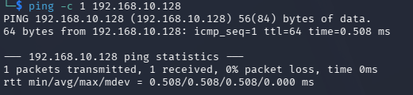
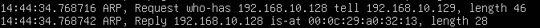

# ARP Packet Capture with tcpdump

## 目的

`tcpdump`　を使用してARP通信をキャプチャし、
IPv4アドレスからMACアドレスを取得する際に
ARP RequestとARP Replyが実際に発生することを確認する。

## 環境

- Kali Linux
  - IPv4: `192.168.10.129`
  - Interface: `eth0`
 
- Ubuntu Server
  - IPv4: `192.168.10.128`
  - Interface: `ens33`
 
- VMware Host-only Network
  - Network: `192.168.10.0/24`
 
## 1. Ubuntu ServerでARP通信を監視

Ubuntu Serverで以下のコマンドを実行した。

    sudo tcpdump -ni ens33 arp

オプションの意味:

- `-n`: IPアドレスなどを名前解決せず。そのまま表示する
- `-i ens33`: ens33インターフェースを監視する
- `arp`: ARP通信だけをキャプチャする

## 2. Kali Linuxからpingを実行

Kali LinuxからUbuntu Serverへ1回だけpingを実行した。

    ping -c 1 192.168.10.128

結果:

- 1 packet transmitted
- 1 received
- 0% packet loss

Ubuntu Serverへの疎通が成功した。

### Kali Linuxでの実行結果

## 3. tcpdumpでARP通信を確認

Ubuntu Serverの `tcpdump` で、
ARP RequestとARP Replyを確認した。

### Ubuntu Serverでのキャプチャ結果

今回確認できた主な通信:

    ARP, Request who-has 192.168.10.128 tell 192.168.10.129

    ARP, Reply 192.168.10.128 is-at 00:0c:29:a0:32:13

## 4. ARP Request

以下のARP Requestを確認した。

    ARP, Request who-has 192.168.10.128 tell 192.168.10.129

これは、

「192.168.10.128を持っている機器は、
192.168.10.129にMACアドレスを教えてください」

という問い合わせを意味する。

今回の場合、

- `192.168.10.129`: Kali Linux
- `192.168.10.128`: Ubuntu Server

である。

つまり、Kali LinuxがUbuntu ServerのMACアドレスを問い合わせている。

## 5. ARP Reply

続いて以下のARP Replyを確認した。

    ARP, Reply 192.168.10.128 is-at 00:0c:29:a0:32:13

これはUbuntu Serverが、

「192.168.10.128のMACアドレスは
00:0c:29:a0:32:13です」

とKali Linuxへ返していることを意味する。

これによりKali Linuxは、

`192.168.10.128`

と

`00:0c:29:a0:32:13`

の対応を知ることができる。

## 6. 通信の流れ

今回確認した通信の流れは以下の通り。

Kali Linux

`192.168.10.129`

↓

ARP Request

「192.168.10.128のMACアドレスを教えて」

↓

Ubuntu Server

`192.168.10.128`

↓

ARP Reply

「MACアドレスは00:0c:29:a0:32:13」

↓

Kali LinuxがUbuntu ServerのMACアドレスを取得

↓

ICMP Echo Requestを送信

↓

Ubuntu ServerからICMP Echo Replyを受信

## 7. tcpdumpのフィルタ

今回使用したコマンドでは、

    arp

を指定しているため、
ARP通信だけが表示される。

`ping` を実行したため、
実際にはICMP通信も発生している。

しかし今回はARPだけを表示するように
tcpdumpをフィルタしているため、
ICMP Echo RequestやICMP Echo Replyは画面に表示されていない。

## 8. 前回のip neighとの関係

前回 `ip neigh` を実行した際に、

IPv4アドレス:

`192.168.10.128`

MACアドレス:

`00:0c:29:a0:32:13`

という対応を確認した。

今回のtcpdumpによって、
この対応情報がARP RequestとARP Replyによって取得されていることを確認できた。

つまり、

`ip neigh`

で確認した結果だけでなく、
その情報が作られるまでの通信も実際に観察することができた。

## 9. OSI参照モデルとの関係

今回の通信は、
OSI参照モデルのLayer 2とLayer 3の関係を理解する上でも重要である。

### Layer 3 / Network Layer

IPv4アドレスを使用する。

- Kali Linux: `192.168.10.129`
- Ubuntu Server: `192.168.10.128`

### Layer 2 / Data Link Layer

Ethernet通信ではMACアドレスを使用する。

Ubuntu Server:

`00:0c:29:a0:32:13`

同一LAN内でIPv4通信を行う場合、
IPv4アドレスだけではなくMACアドレスも必要になる。

ARPを使用することで、

`IPv4アドレス → MACアドレス`

の対応を取得する。

## 学んだこと

- `tcpdump` を使用して実際のパケットを確認できる
- tcpdumpでは特定のプロトコルだけをフィルタできる
- ARP RequestでIPv4アドレスに対応するMACアドレスを問い合わせる
- ARP Replyで対応するMACアドレスが返される
- `ip neigh` で確認したNeighbor Tableの情報がARPによって取得されている
- 同一LAN内のIPv4通信ではLayer 3のIPアドレスだけでなくLayer 2のMACアドレスも使われる
- ping実行時には、必要に応じてARPによるMACアドレス解決が先に行われる

## Next

次は `tcpdump` でICMP通信をキャプチャし、
ICMP Echo RequestとICMP Echo Replyを実際に確認する。
    
