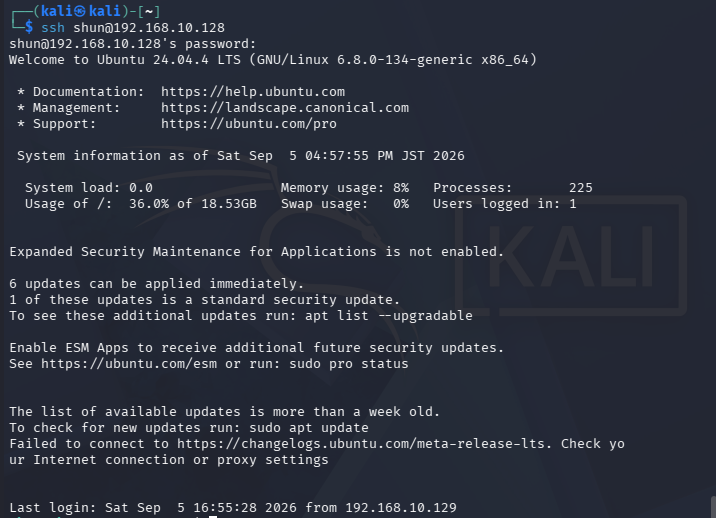
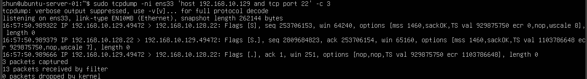

# TCP 3-Way Handshake with tcpdump

## 目的

`tcpdump` を使用してTCP接続開始時の通信をキャプチャし、
TCP 3-way handshakeである

SYN

SYN/ACK

ACK

の3つの通信を実際に確認する。

今回はKali LinuxからUbuntu ServerのSSHサービスへ接続し、
TCP接続が確立されるまでの流れを観察する。

## 環境

- Kali Linux
  - IPv4: `192.168.10.129`

- Ubuntu Server
  - IPv4: `192.168.10.128`
  - SSH Port: `22`

- VMware Host-only Network
  - Network: `192.168.10.0/24`

## 1. Ubuntu ServerでTCP通信を監視

Ubuntu Serverで以下のコマンドを実行した。

    sudo tcpdump -ni ens33 'host 192.168.10.129 and tcp port 22' -c 3

オプションの意味:

- `-n`: IPアドレスやポート番号を名前解決せず表示する
- `-i ens33`: `ens33` インターフェースを監視する
- `host 192.168.10.129`: Kali Linuxとの通信だけを対象にする
- `tcp port 22`: SSHで使用するTCP 22番ポートだけを対象にする
- `-c 3`: 3パケット取得したら自動終了する

## 2. Kali LinuxからSSH接続

Kali LinuxからUbuntu ServerへSSH接続した。

    ssh shun@192.168.10.128

SSH接続後、Ubuntu Serverへのログインに成功した。

### Kali Linuxでの実行結果

## 3. TCP 3-way handshakeの確認

Ubuntu Server側のtcpdumpで以下の3パケットを確認した。

主な結果:

    192.168.10.129.49472 > 192.168.10.128.22: Flags [S]

    192.168.10.128.22 > 192.168.10.129.49472: Flags [S.]

    192.168.10.129.49472 > 192.168.10.128.22: Flags [.]

この3パケットがTCP 3-way handshakeである。

## 4. SYN

最初にKali LinuxからUbuntu Serverへ以下の通信が送信された。

    192.168.10.129.49472 > 192.168.10.128.22: Flags [S]

`[S]` はSYNフラグを表す。

送信元:

- Kali Linux
- IPv4: `192.168.10.129`
- Port: `49472`

送信先:

- Ubuntu Server
- IPv4: `192.168.10.128`
- Port: `22`

Kali LinuxがUbuntu Serverに対して、
TCP接続を開始したいことを通知している。

## 5. SYN/ACK

Ubuntu ServerからKali Linuxへ以下の通信が返された。

    192.168.10.128.22 > 192.168.10.129.49472: Flags [S.]

`[S.]` はSYNとACKが設定されていることを表す。

Ubuntu Serverは、

「接続要求を受け取りました。
こちらからも接続を開始します」

という意味の応答を返している。

今回のtcpdumpでは、

    seq 2809684823
    ack 253706154

などの値も確認できた。

ACK番号は、
相手から受信したSYNのSequence Numberに1を加えた値になる。

## 6. ACK

最後にKali LinuxからUbuntu Serverへ以下の通信が送信された。

    192.168.10.129.49472 > 192.168.10.128.22: Flags [.]

`[.]` はACKを表す。

このACKによって、
Kali LinuxとUbuntu Serverの両方が
相互に通信可能であることを確認し、
TCP接続が成立する。

## 7. TCP 3-way handshakeの流れ

今回確認した通信は以下の通り。

Kali Linux

`192.168.10.129:49472`

↓

SYN

↓

Ubuntu Server

`192.168.10.128:22`

↓

SYN/ACK

↓

Kali Linux

↓

ACK

↓

TCP Connection Established

## 8. ポート番号

今回の通信では、

Kali Linux:

`49472`

Ubuntu Server:

`22`

が使用された。

Ubuntu Serverの22番ポートはSSHサービスが待ち受けているポートである。

Kali Linux側の49472番ポートは、
接続時に一時的に割り当てられた送信元ポートである。

このような一時的なポートは
Ephemeral Portと呼ばれる。

## 9. SSHとの関係

今回確認した3-way handshakeは
SSHそのものの認証処理ではなく、
SSH通信を開始する前段階のTCP接続確立処理である。

通信の流れは以下のようになる。

TCP 3-way handshake

↓

TCP接続成立

↓

SSHプロトコルによる通信開始

↓

ユーザー認証

↓

Ubuntu Serverへログイン

## 10. 前回までの実験との関係

これまでの実験では、

ARP

ICMP

TCP

を順番に確認した。

同一LAN内で通信する際には、

IPv4アドレスを指定

↓

必要に応じてARPでMACアドレスを取得

↓

Ethernet Frameを送信

↓

IP通信

↓

TCPの場合は3-way handshake

↓

アプリケーションプロトコルによる通信

という流れになる。

今回のSSH通信では、
TCP接続成立後にSSHプロトコルが利用されている。

## 学んだこと

- TCP接続開始時には3-way handshakeが行われる
- `Flags [S]` はSYNを表す
- `Flags [S.]` はSYN/ACKを表す
- `Flags [.]` はACKを表す
- TCPではSequence NumberとAcknowledgment Numberが利用される
- ACK番号は受信したSYNのSequence Numberに1を加えた値になる
- SSHはTCP 22番ポートを利用する
- クライアント側ではEphemeral Portが一時的に使用される
- TCP接続が確立した後にSSH通信と認証が行われる

## Next

次はTCP接続終了時の

FIN

ACK

の通信を確認し、
TCP接続がどのように終了するのかを観察する。
