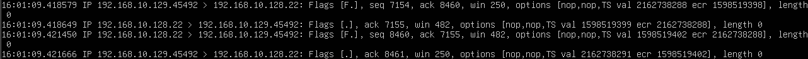

# TCP Connection Close with tcpdump

## 目的

`tcpdump` を使用して、
SSH接続を終了した際のTCP通信を観察する。

TCP接続開始時には3-way handshakeが行われることを前回確認した。

今回はTCP接続終了時に使用される
FINとACKの通信を確認する。

## 環境

- Kali Linux
  - IPv4: `192.168.10.129`

- Ubuntu Server
  - IPv4: `192.168.10.128`
  - SSH Port: `22`

- VMware Host-only Network
  - Network: `192.168.10.0/24`

## 1. SSH接続を終了

Kali LinuxからUbuntu ServerへSSH接続した後、
以下のコマンドを実行して接続を終了した。

    exit

### Kali Linuxでの実行結果

以下の表示を確認した。

    Connection to 192.168.10.128 closed.

## 2. tcpdumpでTCP接続終了を確認

Ubuntu Server側でSSH通信を監視した。

接続終了時に以下の4パケットを確認した。

主な結果:

    192.168.10.129.45492 > 192.168.10.128.22: Flags [F.], seq 7154, ack 8460

    192.168.10.128.22 > 192.168.10.129.45492: Flags [.], ack 7155

    192.168.10.128.22 > 192.168.10.129.45492: Flags [F.], seq 8460, ack 7155

    192.168.10.129.45492 > 192.168.10.128.22: Flags [.], ack 8461

## 3. 最初のFIN

Kali LinuxからUbuntu Serverへ以下のパケットが送信された。

    Flags [F.]

`F` はFINフラグを表す。

これはKali Linuxが、

「こちらから送信するデータはもうありません」

とUbuntu Serverへ通知している。

今回のFINでは、

    seq 7154

となっている。

## 4. Ubuntu ServerからACK

Ubuntu ServerはFINを受信すると、
以下のACKを返した。

    Flags [.], ack 7155

FINはSequence Numberを1つ消費する。

そのため、

    7154 + 1 = 7155

となり、ACK番号は `7155` になっている。

## 5. Ubuntu ServerからFIN

続いてUbuntu ServerからKali LinuxへFINが送信された。

    Flags [F.], seq 8460, ack 7155

これによってUbuntu Server側も、

「こちらから送信するデータはもうありません」

とKali Linuxへ通知している。

## 6. Kali Linuxから最後のACK

Kali LinuxはUbuntu ServerのFINに対してACKを返した。

    Flags [.], ack 8461

Ubuntu ServerのFINのSequence Numberは、

    seq 8460

であるため、

    8460 + 1 = 8461

となっている。

このACKによってTCP接続終了の通信が完了した。

## 7. TCP接続終了の流れ

今回確認した通信は以下の通り。

Kali Linux

`192.168.10.129:45492`

↓

FIN + ACK

↓

Ubuntu Server

`192.168.10.128:22`

↓

ACK

↓

Ubuntu Server

↓

FIN + ACK

↓

Kali Linux

↓

ACK

↓

TCP Connection Closed

## 8. なぜ4回通信するのか

TCPは双方向通信である。

一方の端末がFINを送信しても、
それはその端末からの送信を終了することを意味するだけであり、
反対方向の通信はまだ継続できる。

そのため、

1. Kali Linuxが送信終了を通知する
2. Ubuntu Serverが確認する
3. Ubuntu Serverも送信終了を通知する
4. Kali Linuxが確認する

という流れになる。

接続開始時の3-way handshakeとは異なり、
典型的な接続終了では4回のパケット交換が行われる。

## 9. SYNとの共通点

前回確認したTCP 3-way handshakeでは、
SYNを受信した側のACK番号は、

Sequence Number + 1

になっていた。

FINでも同じようにSequence Numberを1つ消費する。

今回も、

Kali Linux:

    FIN seq 7154
    ACK 7155

Ubuntu Server:

    FIN seq 8460
    ACK 8461

という関係を確認できた。

## 10. TCP接続の一連の流れ

これまでの実験によって、
TCP接続の開始から終了までを確認できた。

接続開始:

SYN

↓

SYN/ACK

↓

ACK

↓

TCP Connection Established

↓

SSH通信

↓

FIN/ACK

↓

ACK

↓

FIN/ACK

↓

ACK

↓

TCP Connection Closed

## 学んだこと

- TCP接続終了時にはFINとACKが使用される
- `Flags [F.]` はFIN + ACKを表す
- `Flags [.]` はACKを表す
- FINはSequence Numberを1つ消費する
- TCPは双方向通信なので、それぞれの方向を個別に終了する
- TCP接続終了時には典型的に4パケットが交換される
- 3-way handshakeから接続終了までのTCP通信の流れを実際に確認できた

## Next

ここまでで `01-network-basics` の実験は一区切りとする。

次は `02-port-scanning` に進み、
Ubuntu Serverで待ち受けているポートを確認した後、
Kali LinuxからNmapを使用して
ネットワーク越しに見えるサービスを調査する。

→ [02-port-scanning](../02-port-scanning/)
