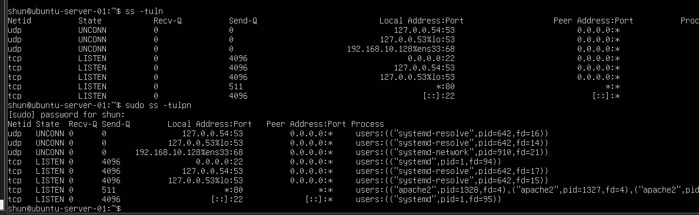
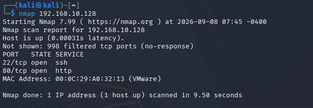
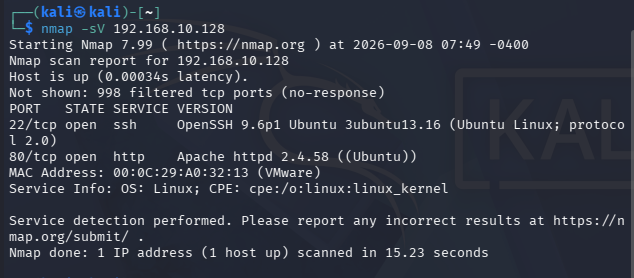

# Port Scan and Service Detection

## 目的

Ubuntu Server内部で待ち受けているポートを確認し、
Kali LinuxからNmapを使用してネットワーク越しに見えるポートと比較する。

また、NmapのService Version Detectionを使用して、
公開されているサービスの種類とソフトウェア情報を確認する。

## 環境

- Kali Linux
  - IPv4: `192.168.10.129`

- Ubuntu Server
  - IPv4: `192.168.10.128`

- VMware Host-only Network
  - Network: `192.168.10.0/24`

## 1. Ubuntu Server内部で待受ポートを確認

Ubuntu Serverで以下のコマンドを実行した。

    ss -tuln

さらに、各ポートを使用しているプロセスも確認するため、
以下のコマンドを実行した。

    sudo ss -tulpn

### 実行結果

主に以下のポートを確認できた。

- TCP 22
- TCP 80
- TCP/UDP 53
- UDP 68

`sudo ss -tulpn` の結果から、
80番ポートでは `apache2` が動作していることを確認できた。

また、22番ポートではSSH接続を受け付ける状態になっていた。

一方で、

`127.0.0.53:53`

のようにLoopback側で待ち受けているポートも確認できた。

## 2. Kali LinuxからNmapを実行

次にKali LinuxからUbuntu ServerへNmapを実行した。

    nmap 192.168.10.128

### 実行結果

以下のポートが `open` と判定された。

- `22/tcp open ssh`
- `80/tcp open http`

また、以下の表示も確認した。

    Not shown: 998 filtered tcp ports (no-response)

Ubuntu Server内部では複数のポートを確認できたが、
Kali Linuxからネットワーク越しに `open` と確認できたTCPポートは
22番と80番だった。

## 3. ssとNmapの比較

今回使用した `ss` と `nmap` では、
確認している視点が異なる。

### ss

`ss` はUbuntu Server自身の内部から、
どのソケットが待ち受けているかを確認する。

つまり、

「このサーバー自身では何が待ち受けているか」

を確認するために使用した。

### Nmap

NmapはKali Linuxからネットワーク越しにUbuntu Serverを調査する。

つまり、

「他の端末からUbuntu Serverがどのように見えるか」

を確認するために使用した。

今回、

Ubuntu Server内部では、

- TCP 22
- TCP 80
- TCP/UDP 53
- UDP 68

を確認した。

一方、Kali LinuxからのNmapでは、

- TCP 22
- TCP 80

が `open` と判定された。

この結果から、

サーバー内部で確認できるポートと、
ネットワーク越しにアクセス可能なポートは
必ずしも同じではないことを確認できた。

## 4. TCP SYN Scan

以下のコマンドも実行した。

    nmap -sS 192.168.10.128

`-sS` はTCP SYN Scanを明示的に指定するオプションである。

今回の環境では、

- `22/tcp open ssh`
- `80/tcp open http`

という結果になり、
通常の `nmap 192.168.10.128` と実質的に同じ結果だった。

そのため、重複するスクリーンショットは省略した。

TCP SYN Scanの通信内容については、
今後tcpdumpなどを使用して実際のパケットを観察する。

## 5. Service Version Detection

次に以下のコマンドを実行した。

    nmap -sV 192.168.10.128

`-sV` を使用すると、
開いているポートだけでなく、
そのポートで動作しているサービスの情報も調査できる。

### 実行結果

以下の情報を確認できた。

### TCP 22

Service:

`ssh`

Software:

`OpenSSH 9.6p1 Ubuntu 3ubuntu13.16`

### TCP 80

Service:

`http`

Software:

`Apache httpd 2.4.58`

通常のNmapでは、

    22/tcp open ssh
    80/tcp open http

まで確認できた。

一方、`-sV` を使用すると、
OpenSSHやApacheなど、
実際に動作しているソフトウェアの情報まで確認できた。

## 6. ポートスキャンとセキュリティ

ネットワーク上からアクセス可能なポートは、
外部から利用できるサービスの入口になる。

今回のUbuntu Serverでは、

- TCP 22 → SSH
- TCP 80 → HTTP

がKali Linuxから確認できた。

さらに、Service Version Detectionによって、
OpenSSHやApacheのソフトウェア情報も確認できた。

このような情報は、
管理者が公開しているサービスを把握するためにも利用できる。

一方で、攻撃者が対象システムの情報収集を行う際にも
利用される可能性がある。

そのため、

不要なサービスを停止すること

不要なポートを外部へ公開しないこと

使用しているソフトウェアを適切に更新すること

が重要である。

## 学んだこと

- `ss` でLinux内部の待受ポートを確認できる
- `sudo ss -tulpn` でポートを使用しているプロセスも確認できる
- Nmapを使用するとネットワーク越しに公開されているポートを確認できる
- サーバー内部で見えるポートと外部から見えるポートは必ずしも一致しない
- TCP 22番ポートではSSHが利用されている
- TCP 80番ポートではHTTPが利用されている
- `nmap -sS` でTCP SYN Scanを明示的に実行できる
- 今回は通常のNmapとSYN Scanで実質的に同じ結果になった
- `nmap -sV` ではサービスの種類だけでなくソフトウェア情報も確認できる
- ポートスキャンはサーバーがネットワークからどのように見えているかを確認する手段になる

## Next

次はUbuntu ServerのFirewall設定を確認し、
Nmapで表示された `filtered` とFirewallの関係を調べる。
