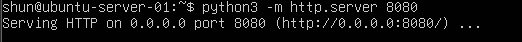
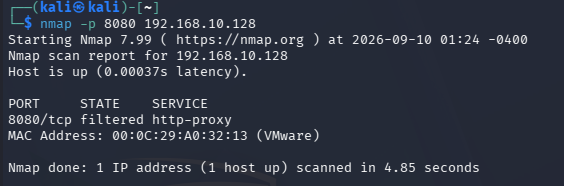
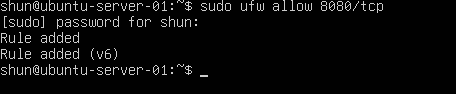
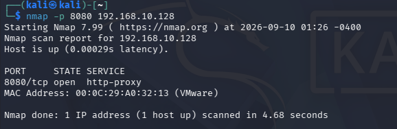

# Firewall and Filtered Ports

## 目的

Ubuntu Serverで一時的にHTTPサーバーを8080番ポートで起動し、
Kali LinuxからNmapでポートの状態を確認する。

その後、UFWで8080/tcpを許可し、
Nmapの結果が `filtered` から `open` に変化することを確認する。

これにより、

- サービスが待ち受けていること
- Firewallが通信を許可していること
- 外部からポートが見えること

はそれぞれ別の要素であることを確認する。

## 環境

- Kali Linux
  - IPv4: `192.168.10.129`

- Ubuntu Server
  - IPv4: `192.168.10.128`

- VMware Host-only Network
  - Network: `192.168.10.0/24`

- Firewall
  - UFW

## 1. Ubuntu ServerでHTTPサーバーを起動

Ubuntu ServerでPythonの簡易HTTPサーバーを8080番ポートで起動した。

    python3 -m http.server 8080

実行すると以下のように表示された。

    Serving HTTP on 0.0.0.0 port 8080 (http://0.0.0.0:8080/) ...

### 実行結果

`0.0.0.0:8080` で待ち受けているため、
特定の1つのIPv4アドレスだけではなく、
利用可能なIPv4インターフェースで8080番ポートを待ち受けている。

## 2. Ubuntu Server内部で待受状態を確認

別のターミナルで以下のコマンドを実行した。

    ss -tuln | grep 8080

以下のように8080番ポートが `LISTEN` 状態であることを確認した。

    tcp LISTEN 0 5 0.0.0.0:8080 0.0.0.0:*

この時点で、
Ubuntu Server内部では8080番ポートでサービスが起動していることが分かる。

## 3. UFWで8080番ポートを許可する前にNmapを実行

Kali LinuxからUbuntu Serverの8080番ポートを調査した。

    nmap -p 8080 192.168.10.128

### 実行結果

以下の結果を確認した。

    8080/tcp filtered http-proxy

Ubuntu Server内部では8080番ポートが `LISTEN` 状態だったが、
Kali Linuxからは `filtered` と判定された。

この時点ではUFWで8080/tcpを許可していなかったため、
Firewallによって通信が遮断されていると考えられる。

## 4. UFWで8080/tcpを許可

Ubuntu Serverで以下のコマンドを実行した。

    sudo ufw allow 8080/tcp

### 実行結果

以下の表示を確認した。

    Rule added
    Rule added (v6)

これにより、
8080/tcpへの受信通信をUFWで許可した。

## 5. 再度Nmapを実行

UFWの設定変更後、
Kali Linuxから同じコマンドを再度実行した。

    nmap -p 8080 192.168.10.128

### 実行結果

今度は以下の結果になった。

    8080/tcp open http-proxy

UFWで8080/tcpを許可したことで、
Nmapの判定が

`filtered`

から

`open`

へ変化した。

## 6. filteredとopenの違い

今回の実験では、
同じUbuntu Server上で同じHTTPサーバーを起動したまま、
Firewallの設定だけを変更した。

### UFWで許可する前

Ubuntu Server内部:

    8080 LISTEN

Kali Linuxから:

    8080/tcp filtered

### UFWで許可した後

Ubuntu Server内部:

    8080 LISTEN

Kali Linuxから:

    8080/tcp open

つまり、

サービスが起動しているだけでは、
ネットワーク越しにアクセス可能とは限らないことを確認できた。

Firewallが通信を遮断している場合、
Nmapでは `filtered` と判定されることがある。

## 7. ss・UFW・Nmapの関係

今回使用した3つは、
それぞれ確認している内容が異なる。

### ss

Ubuntu Server内部で、
どのポートが待ち受けているかを確認する。

今回:

    0.0.0.0:8080 LISTEN

### UFW

ネットワークから届いた通信を
許可するか遮断するかを制御する。

今回:

8080/tcpを許可する前

↓

Nmapでは `filtered`

8080/tcpを許可

↓

Nmapでは `open`

### Nmap

Kali Linuxからネットワーク越しに
Ubuntu Serverがどのように見えるかを確認する。

この3つを比較することで、

`サービスの待受状態`

`Firewallの設定`

`外部から見える状態`

は別々に考える必要があることを確認できた。

## 8. NmapのSERVICE表示について

Nmapでは以下のように表示された。

    8080/tcp open http-proxy

今回実際に起動していたのは、

    python3 -m http.server 8080

によるPythonの簡易HTTPサーバーである。

そのため、
`http-proxy` という表示だけで
実際にHTTP Proxyソフトウェアが動作していると断定することはできない。

Nmapの通常のSERVICE欄は、
ポート番号に一般的に対応付けられているサービス名として
表示される場合がある。

実際に動作しているソフトウェアを詳しく調べる場合は、
`-sV` などによるService Version Detectionが必要になる。

## 9. UFWルールを元に戻す

実験終了後、
追加した8080/tcpの許可ルールを削除した。

    sudo ufw delete allow 8080/tcp

以下の表示を確認した。

    Rule deleted
    Rule deleted (v6)

これによって、
実験前のFirewall設定に戻した。

また、PythonのHTTPサーバーも `Ctrl+C` で終了した。

## 学んだこと

- サービスが起動していても外部からアクセスできるとは限らない
- `ss` でサーバー内部の待受ポートを確認できる
- UFWで受信通信を許可・遮断できる
- Nmapでは外部から見たポートの状態を確認できる
- Firewallで通信が遮断されているポートは `filtered` と判定されることがある
- Firewallで通信を許可すると `open` と判定されることを確認できた
- `LISTEN` と `open` は同じ意味ではない
- NmapのSERVICE欄だけでは実際のソフトウェアを断定できない
- 実験後は追加したFirewallルールや一時サービスを元に戻すことが重要

## Next

次はNmapのTCP SYN Scanをtcpdumpで観察し、
通常のTCP 3-way handshakeとの違いを確認する。
