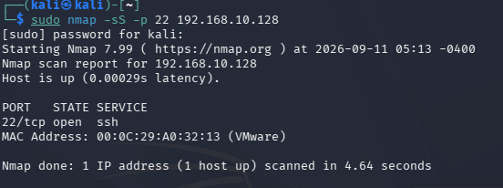
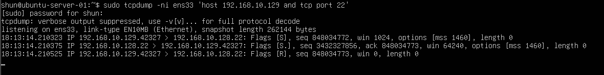

# TCP SYN Scan Packet Analysis

## 目的

Kali LinuxからUbuntu ServerへTCP SYN Scanを実行し、
`tcpdump` を使用して実際にどのようなTCPパケットが送受信されるか確認する。

また、以前確認した通常のTCP 3-way handshakeと比較し、
SYN ScanがTCP接続を最後まで成立させない
Half-open Scanであることを確認する。

## 環境

- Kali Linux
  - IPv4: `192.168.10.129`

- Ubuntu Server
  - IPv4: `192.168.10.128`
  - SSH Port: `22`

- VMware Host-only Network
  - Network: `192.168.10.0/24`

## 1. Ubuntu ServerでTCP通信を監視

Ubuntu Serverで以下のコマンドを実行した。

    sudo tcpdump -ni ens33 'host 192.168.10.129 and tcp port 22'

このコマンドでは、

- `-n`: IPアドレスやポート番号を名前解決せず表示する
- `-i ens33`: `ens33` インターフェースを監視する
- `host 192.168.10.129`: Kali Linuxとの通信だけを対象にする
- `tcp port 22`: TCP 22番ポートの通信だけを対象にする

という条件でパケットを監視した。

## 2. Kali LinuxからSYN Scanを実行

Kali Linuxで以下のコマンドを実行した。

    sudo nmap -sS -p 22 192.168.10.128

`-sS` はTCP SYN Scanを指定する。

`-p 22` により、
今回はSSHで使用される22番ポートだけを対象にした。

### Nmapの実行結果

以下の結果を確認した。

    22/tcp open ssh

NmapはUbuntu Serverの22番ポートを
`open` と判定した。

## 3. tcpdumpでSYN Scanを確認

Ubuntu Server側のtcpdumpでは、
以下の3パケットを確認した。

主な結果:

    192.168.10.129.42327 > 192.168.10.128.22: Flags [S], seq 848034772

    192.168.10.128.22 > 192.168.10.129.42327: Flags [S.], seq 3432327856, ack 848034773

    192.168.10.129.42327 > 192.168.10.128.22: Flags [R], seq 848034773

今回確認した通信は、

SYN

↓

SYN/ACK

↓

RST

という流れになっていた。

## 4. SYN

最初にKali LinuxからUbuntu Serverへ以下のパケットが送信された。

    Flags [S]

`S` はSYNフラグを表す。

これはKali Linuxが、

「22番ポートでTCP接続できますか」

と確認するための接続要求である。

今回のSequence Numberは、

    seq 848034772

だった。

## 5. SYN/ACK

Ubuntu Serverから以下のパケットが返された。

    Flags [S.]

`S.` はSYN + ACKを表す。

これはUbuntu Serverが、

「22番ポートで接続を受け付けています」

と応答していることを意味する。

今回のAcknowledgment Numberは、

    ack 848034773

だった。

Kali Linuxが送信したSYNのSequence Numberは、

    848034772

だったため、

    848034772 + 1 = 848034773

となっている。

SYNはSequence Numberを1つ消費するため、
ACK番号は受信したSYNのSequence Number + 1になる。

## 6. RST

最後にKali Linuxから以下のパケットが送信された。

    Flags [R]

`R` はRST（Reset）フラグを表す。

Ubuntu ServerからSYN/ACKが返された時点で、
Nmapは22番ポートが `open` であると判断できる。

そのため通常のTCP接続のようにACKを返して
接続を成立させるのではなく、
RSTを送信して接続処理を終了している。

## 7. 通常のTCP接続との比較

以前SSH接続を使用して確認した
通常のTCP 3-way handshakeは以下の流れだった。

    SYN
    ↓
    SYN/ACK
    ↓
    ACK
    ↓
    TCP Connection Established

今回のTCP SYN Scanでは以下の流れになった。

    SYN
    ↓
    SYN/ACK
    ↓
    RST
    ↓
    Connection Reset

つまり、通常のTCP接続では最後にACKを送信して
接続を成立させる。

一方、SYN ScanではSYN/ACKを受信した時点で
ポートが開いていることを判断し、
RSTを送信してTCP接続を完成させない。

このためTCP SYN Scanは
Half-open Scanとも呼ばれる。

## 8. Nmapがopenと判断する仕組み

今回の実験では、

Kali Linux

↓

SYN

↓

Ubuntu Server

↓

SYN/ACK

↓

Kali Linux

という通信を確認した。

NmapはSYN/ACKが返ってきたことで、

「このポートではTCP接続を受け付けている」

と判断し、

    22/tcp open ssh

と表示した。

その後RSTを送信して、
実際のTCP接続は成立させなかった。

## 9. ポート番号

今回の通信では、

Kali Linux:

`42327`

Ubuntu Server:

`22`

が使用された。

Ubuntu Serverの22番ポートは、
SSHサービスが待ち受けているWell-known Portである。

Kali Linux側の42327番ポートは、
通信時に一時的に使用されたEphemeral Portである。

## セキュリティとの関係

TCP SYN Scanを使用すると、
対象ポートに完全なTCP接続を行わなくても
ポートが開いているか確認できる。

ポートスキャンでは、
このような通信を利用して
対象システムで公開されているサービスを調査できる。

一方、管理者側では、
FirewallやIDS/IPSなどを使用して
不審なスキャン通信を監視・制御することが重要になる。

今後は、このSYN Scanが
IDSなどからどのように見えるかも確認していく。

## 学んだこと

- `nmap -sS` でTCP SYN Scanを実行できる
- TCP SYN ScanではSYNを送信してポートの状態を確認する
- openなポートからはSYN/ACKが返される
- NmapはSYN/ACKを受信するとポートを `open` と判断する
- SYN Scanでは最後にACKではなくRSTを送信する
- TCP接続を最後まで成立させないためHalf-open Scanと呼ばれる
- SYNはSequence Numberを1つ消費する
- 通常の3-way handshakeとの違いを実際のパケットで確認できた

## Next

次はclosedポートに対してSYN Scanを実行し、
openポートの場合との応答の違いを確認する。
