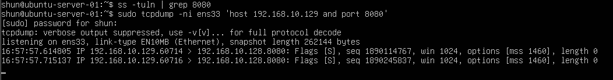
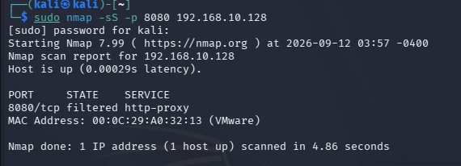
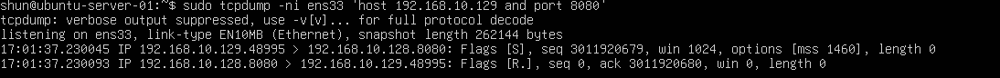
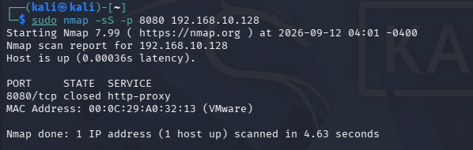

# Closed and Filtered Port SYN Scan

## 目的

Kali LinuxからUbuntu Serverの8080番ポートへTCP SYN Scanを実行し、
`filtered` と `closed` の違いを実際のパケットで確認する。

今回は、

- サービスが起動していない
- Firewallで遮断されている
- Firewallでは許可されているがサービスは起動していない

という状態を比較し、
Nmapがどのようにポート状態を判定しているかを確認する。

## 環境

- Kali Linux
  - IPv4: `192.168.10.129`

- Ubuntu Server
  - IPv4: `192.168.10.128`

- VMware Host-only Network
  - Network: `192.168.10.0/24`

- Test Port
  - TCP `8080`

## 1. 8080番ポートでサービスが動いていないことを確認

Ubuntu Serverで以下のコマンドを実行した。

    ss -tuln | grep 8080

何も表示されなかったため、
8080番ポートではサービスが待ち受けていないことを確認した。

## 2. Firewallで8080番ポートを許可していない状態

Ubuntu Serverで以下のコマンドを実行し、
Kali Linuxから8080番ポートへのTCP通信を監視した。

    sudo tcpdump -ni ens33 'host 192.168.10.129 and tcp port 8080'

その状態でKali Linuxから以下を実行した。

    sudo nmap -sS -p 8080 192.168.10.128

### tcpdumpの結果

Kali LinuxからUbuntu Serverへ
SYNパケットが送信されていることを確認した。

    Flags [S]

しかし、Ubuntu Server側から
SYN/ACKやRSTなどの応答は確認できなかった。

### Nmapの結果

以下の結果を確認した。

    8080/tcp filtered http-proxy

NmapはSYNを送信したが応答を受信できなかったため、
8080番ポートを `filtered` と判定した。

## 3. UFWで8080/tcpを許可

次にUbuntu Serverで以下のコマンドを実行した。

    sudo ufw allow 8080/tcp

これにより、
8080番ポートへのTCP受信通信をFirewallで許可した。

この時点でも、
8080番ポートではサービスを起動していない。

## 4. Firewall許可後に再度SYN Scanを実行

Ubuntu Serverで再度tcpdumpを実行した。

    sudo tcpdump -ni ens33 'host 192.168.10.129 and tcp port 8080'

その状態でKali Linuxから以下を実行した。

    sudo nmap -sS -p 8080 192.168.10.128

### tcpdumpの結果

以下の通信を確認した。

    Kali Linux → Ubuntu Server
    Flags [S]

    Ubuntu Server → Kali Linux
    Flags [R.]

`[R.]` はRST + ACKを表す。

Ubuntu ServerはSYNを受信したが、
8080番ポートで待ち受けているサービスが存在しないため、
RST/ACKを返している。

### Nmapの結果

以下の結果を確認した。

    8080/tcp closed http-proxy

NmapはUbuntu ServerからRST/ACKを受信したため、
8080番ポートを `closed` と判定した。

## 5. filteredとclosedの違い

今回の実験では、
8080番ポートでサービスを起動していない状態のまま、
Firewall設定だけを変更した。

### filtered

Firewallで8080/tcpを許可していない状態:

    Kali → SYN
    Ubuntu → 応答なし

Nmap:

    filtered

Nmapから見ると、
SYN/ACKもRSTも返ってこないため、
ポートがopenなのかclosedなのか判断できない。

### closed

Firewallで8080/tcpを許可している状態:

    Kali → SYN
    Ubuntu → RST/ACK

Nmap:

    closed

パケットはUbuntu Serverまで届いているが、
8080番ポートで待ち受けているサービスが存在しないため、
OSがRST/ACKを返している。

## 6. open・closed・filteredの比較

これまでの実験を含めると、
Nmapの代表的なポート状態を以下のように整理できる。

### open

    Kali → SYN
    Ubuntu → SYN/ACK
    Kali → RST

Nmap:

    open

ポートでサービスが接続を受け付けている。

### closed

    Kali → SYN
    Ubuntu → RST/ACK

Nmap:

    closed

パケットは対象ホストまで届いているが、
そのポートではサービスが待ち受けていない。

### filtered

    Kali → SYN
    Ubuntu → 応答なし

Nmap:

    filtered

Firewallなどによって通信が遮断され、
Nmapからポートの状態を判断できない。

## 7. FirewallとNmapの関係

今回、

サービス停止
+
Firewallで遮断

の場合は、

    filtered

となった。

一方、

サービス停止
+
Firewallで許可

の場合は、

    closed

となった。

つまり、
Nmapが表示するポート状態は
サービスの起動状態だけでなく、
Firewallの設定にも影響されることを確認できた。

## 8. 後片付け

実験終了後、
追加したUFWルールを削除した。

    sudo ufw delete allow 8080/tcp

これにより、
実験前のFirewall設定に戻した。

## 学んだこと

- SYN Scanでは対象ポートの応答によって状態を判定する
- openなポートはSYN/ACKを返す
- closedなポートはRST/ACKを返す
- filteredなポートでは応答が返ってこない場合がある
- サービスが起動していなくてもFirewall設定によって `closed` または `filtered` になる
- `closed` は対象ホストまでパケットが届いている状態
- `filtered` はFirewallなどによって状態を判断できない状態
- tcpdumpを使用するとNmapの判定理由をパケットレベルで確認できる

## Next

次はNmapのスキャン方式をさらに比較し、
TCP Connect ScanとSYN Scanの違いを確認する。
