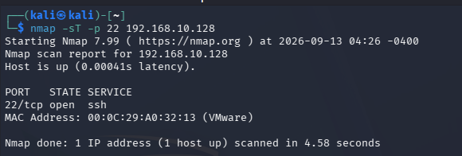
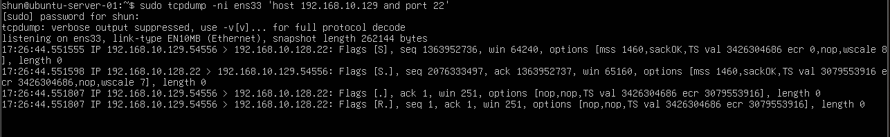

# TCP Connect Scan vs SYN Scan

## 目的

NmapのTCP Connect ScanとTCP SYN Scanの違いを確認する。

以前の実験では、
TCP SYN ScanがTCP接続を最後まで成立させず、

SYN

↓

SYN/ACK

↓

RST

という流れになることを確認した。

今回はTCP Connect Scanを実行し、
通常のTCP 3-way handshakeが成立することを確認する。

また、
以前 `01-network-basics` で確認した通常のTCP接続と比較し、
Nmapのスキャン方式による違いを整理する。

## 環境

- Kali Linux
  - IPv4: `192.168.10.129`

- Ubuntu Server
  - IPv4: `192.168.10.128`
  - SSH Port: `22`

- VMware Host-only Network
  - Network: `192.168.10.0/24`

## 1. Ubuntu ServerでTCP通信を監視

Ubuntu Serverで以下のコマンドを実行した。

    sudo tcpdump -ni ens33 'host 192.168.10.129 and tcp port 22'

このコマンドでは、

- `-n`: IPアドレスやポート番号を名前解決せず表示する
- `-i ens33`: `ens33` インターフェースを監視する
- `host 192.168.10.129`: Kali Linuxとの通信だけを対象にする
- `tcp port 22`: TCP 22番ポートの通信だけを対象にする

という条件でパケットを監視した。

## 2. Kali LinuxからTCP Connect Scanを実行

Kali Linuxで以下のコマンドを実行した。

    nmap -sT -p 22 192.168.10.128

`-sT` はTCP Connect Scanを指定する。

`-p 22` により、
今回はSSHで使用される22番ポートだけを対象にした。

### Nmapの実行結果

以下の結果を確認した。

    22/tcp open ssh

NmapはUbuntu Serverの22番ポートを
`open` と判定した。

## 3. tcpdumpで通信を確認

Ubuntu Server側のtcpdumpでは、
以下の通信を確認した。

主な流れ:

    Flags [S]

    Flags [S.]

    Flags [.]

    Flags [R.]

今回の通信は、

SYN

↓

SYN/ACK

↓

ACK

↓

RST/ACK

という流れになっていた。

## 4. TCP 3-way handshake

最初の3パケットは、

    SYN
    SYN/ACK
    ACK

となっていた。

これは通常のTCP 3-way handshakeと同じである。

つまりTCP Connect Scanでは、
TCP接続を実際に成立させている。

以前 `01-network-basics` で確認した通常のSSH接続でも、

SYN

↓

SYN/ACK

↓

ACK

という3-way handshakeが行われていた。

今回のTCP Connect Scanでも、
同じ接続確立処理を確認できた。

## 5. 接続成立後のRST

TCP接続が成立した直後、
Kali Linuxから以下のパケットが送信された。

    Flags [R.]

`R.` はRST + ACKを表す。

Nmapは22番ポートにTCP接続できることを確認したため、
その後のSSH通信を継続する必要はない。

そのため、
接続確認後にRSTを送信してTCP接続を終了している。

## 6. TCP SYN Scanとの比較

以前実行したTCP SYN Scanでは、
以下の流れを確認した。

    SYN
    ↓
    SYN/ACK
    ↓
    RST

TCP SYN Scanでは、
SYN/ACKが返ってきた時点で
ポートが `open` であると判断できる。

そのため最後のACKを送信せず、
TCP接続を成立させない。

一方、今回のTCP Connect Scanでは、

    SYN
    ↓
    SYN/ACK
    ↓
    ACK
    ↓
    TCP Connection Established
    ↓
    RST

となった。

つまり、

TCP SYN Scan:

TCP接続を最後まで成立させない

TCP Connect Scan:

通常のTCP 3-way handshakeを完了し、
TCP接続を成立させる

という違いがある。

## 7. 通常のSSH接続との比較

これまで確認した通信を比較すると、
以下のようになる。

### 通常のSSH接続

    SYN
    ↓
    SYN/ACK
    ↓
    ACK
    ↓
    TCP接続成立
    ↓
    SSH通信

### TCP Connect Scan

    SYN
    ↓
    SYN/ACK
    ↓
    ACK
    ↓
    TCP接続成立
    ↓
    RST

### TCP SYN Scan

    SYN
    ↓
    SYN/ACK
    ↓
    RST

TCP Connect Scanは通常のTCP接続と同じように
3-way handshakeを完了する。

ただしNmapはポートが開いていることを確認した後、
アプリケーション通信を継続せず接続を終了する。

## 8. -sTと-sSの違い

### TCP Connect Scan (-sT)

- 通常のTCP接続を利用する
- 3-way handshakeを完了する
- TCP接続が実際に成立する
- 一般ユーザーでも実行できる

### TCP SYN Scan (-sS)

- SYNパケットを利用してポート状態を確認する
- 3-way handshakeを完成させない
- SYN/ACKを確認した後RSTを送信する
- Half-open Scanとも呼ばれる

## 学んだこと

- `nmap -sT` でTCP Connect Scanを実行できる
- TCP Connect Scanでは通常の3-way handshakeが行われる
- SYN → SYN/ACK → ACKでTCP接続が成立する
- Nmapは接続確認後にRSTを送信して通信を終了する
- TCP SYN ScanではACKを送信せずTCP接続を完成させない
- `-sT` と `-sS` ではNmapの判定結果が同じでも通信方法が異なる
- tcpdumpを使用することでスキャン方式の違いをパケットレベルで確認できる

## Next

次はNmapのUDP Scanを実行し、
TCPスキャンとの違いを確認する。
