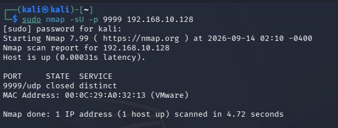
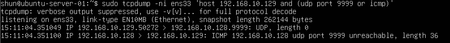
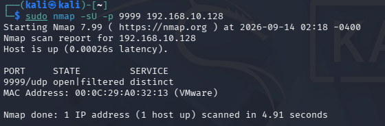
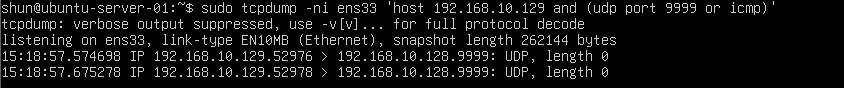

# UDP Scan

## 目的

Kali LinuxからUbuntu ServerへUDP Scanを実行し、
UDPポートが `closed` と `open|filtered` になる場合の違いを確認する。

TCPではSYNやRSTなどの応答を利用してポート状態を判定できるが、
UDPにはTCPのような3-way handshakeが存在しない。

今回は `tcpdump` を使用して実際のパケットを観察し、
NmapがUDPポートの状態をどのように判断しているか確認する。

## 環境

- Kali Linux
  - IPv4: `192.168.10.129`

- Ubuntu Server
  - IPv4: `192.168.10.128`

- VMware Host-only Network
  - Network: `192.168.10.0/24`

- Test Port
  - UDP `9999`

## 1. UDP 9999番ポートにサービスが存在しないことを確認

Ubuntu Serverで以下のコマンドを実行した。

    ss -uln | grep 9999

何も表示されなかったため、
UDP 9999番ポートではサービスが待ち受けていないことを確認した。

## 2. UFWでUDP 9999番ポートを許可

まず、UDP 9999番ポートへの通信をFirewallで許可した。

    sudo ufw allow 9999/udp

この状態では、

- Firewall: UDP 9999を許可
- Service: 起動していない

という構成になる。

## 3. Ubuntu ServerでUDPとICMPを監視

Ubuntu Serverで以下のコマンドを実行した。

    sudo tcpdump -ni ens33 'host 192.168.10.129 and (udp port 9999 or icmp)'

UDPパケットだけでなく、
UDP Scanに対するICMP応答も確認できるようにした。

## 4. Kali LinuxからUDP Scanを実行

Kali Linuxで以下のコマンドを実行した。

    sudo nmap -sU -p 9999 192.168.10.128

`-sU` はUDP Scanを指定する。

`-p 9999` により、
今回はUDP 9999番ポートだけを対象にした。

### Nmapの実行結果

以下の結果を確認した。

    9999/udp closed distinct

NmapはUDP 9999番ポートを `closed` と判定した。

## 5. closedポートのパケットを確認

Ubuntu Server側のtcpdumpでは以下の通信を確認した。

主な流れ:

    Kali Linux → Ubuntu Server
    UDP packet

    Ubuntu Server → Kali Linux
    ICMP Port Unreachable

実際には以下のような通信が発生していた。

    192.168.10.129 > 192.168.10.128.9999: UDP

    192.168.10.128 > 192.168.10.129:
    ICMP udp port 9999 unreachable

Ubuntu ServerまでUDPパケットは届いたが、
9999番ポートで待ち受けているサービスが存在しないため、
ICMP Port Unreachableが返された。

Nmapはこの応答を受信したことで、
UDP 9999番ポートを `closed` と判定した。

## 6. UDP closedの流れ

今回確認した通信は以下の通り。

Kali Linux

↓

UDP packet

↓

Ubuntu Server UDP 9999

↓

待受サービスなし

↓

ICMP Port Unreachable

↓

Kali Linux

↓

Nmap: `closed`

TCPのclosedポートではRST/ACKが返されるが、
UDPではICMP Port Unreachableによって
closedであることを判断できる場合がある。

## 7. UFWの許可ルールを削除

次に、追加していたUDP 9999番ポートの許可ルールを削除した。

    sudo ufw delete allow 9999/udp

これにより、

- Firewall: UDP 9999を許可していない
- Service: 起動していない

という状態に変更した。

## 8. Firewallで遮断された状態で再度UDP Scan

Ubuntu Serverで再度tcpdumpを実行した。

    sudo tcpdump -ni ens33 'host 192.168.10.129 and (udp port 9999 or icmp)'

その状態でKali Linuxから以下を実行した。

    sudo nmap -sU -p 9999 192.168.10.128

### Nmapの実行結果

以下の結果を確認した。

    9999/udp open|filtered distinct

今回はNmapが
`open|filtered`
と判定した。

## 9. open|filteredのパケットを確認

Ubuntu Server側のtcpdumpでは、
Kali Linuxから送信されたUDPパケットを確認した。

しかし、
前回確認できたICMP Port Unreachableは返されていなかった。

通信の流れ:

    Kali Linux
    ↓
    UDP packet
    ↓
    Ubuntu Server
    ↓
    応答なし

Nmapから見ると、

「UDPサービスがopenだが応答を返していない」

可能性と、

「Firewallによってfilteredされている」

可能性を区別できない。

そのため、

    open|filtered

という判定になる。

## 10. closedとopen|filteredの比較

### UDP closed

    UDP packet
    ↓
    ICMP Port Unreachable
    ↓
    Nmap: closed

対象ホストまでパケットが届き、
対象ポートにサービスが存在しないことを示す応答が返されている。

### UDP open|filtered

    UDP packet
    ↓
    応答なし
    ↓
    Nmap: open|filtered

Nmapは応答を受信できないため、
ポートがopenなのかFirewallによってfilteredされているのか
判断できない。

## 11. TCP Scanとの違い

TCPでは、
ポート状態を判断するための応答が比較的明確である。

### TCP open

    SYN
    ↓
    SYN/ACK

### TCP closed

    SYN
    ↓
    RST/ACK

### TCP filtered

    SYN
    ↓
    応答なし

一方UDPにはTCPのような
SYNやSYN/ACKが存在しない。

### UDP closed

    UDP packet
    ↓
    ICMP Port Unreachable

### UDP open|filtered

    UDP packet
    ↓
    応答なし

そのため、
UDP ScanではTCP Scanよりも
ポート状態の判定が難しい場合がある。

## 12. SERVICE表示について

今回Nmapでは、

    9999/udp distinct

と表示された。

これは今回実際に `distinct` というサービスが
動作していたことを意味するわけではない。

Nmapがポート番号9999に一般的に対応付けられている
サービス名として表示している。

今回の実験では、
実際にはUDP 9999番ポートでサービスは起動していない。

## 学んだこと

- `nmap -sU` でUDP Scanを実行できる
- UDPにはTCPのような3-way handshakeが存在しない
- UDPのclosedポートではICMP Port Unreachableが返る場合がある
- NmapはICMP Port Unreachableを受信すると `closed` と判断できる
- UDPで応答がない場合は `open|filtered` と判定されることがある
- `open|filtered` はopenとfilteredを区別できない状態である
- Firewall設定によってUDP Scanの結果も変化する
- TCP ScanとUDP Scanではポート状態の判定方法が異なる
- tcpdumpを使用するとNmapのUDP判定をパケットレベルで確認できる

## Next

次はUDP 9999番ポートで実際にサービスを起動し、
Nmapで `open` と判定される場合の通信を確認する。
