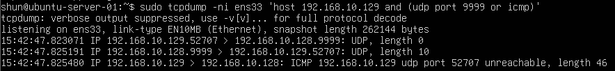
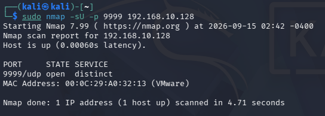

# UDP Open Port Detection

## 目的

Ubuntu ServerのUDP 9999番ポートで実際にサービスを起動し、
Kali LinuxからUDP Scanを実行する。

前回はUDP Scanで、

- `closed`
- `open|filtered`

の状態を確認した。

今回はUDPサービスが実際に応答を返す状態を作り、
NmapがUDPポートを `open` と判定する条件を確認する。

## 環境

- Kali Linux
  - IPv4: `192.168.10.129`

- Ubuntu Server
  - IPv4: `192.168.10.128`

- VMware Host-only Network
  - Network: `192.168.10.0/24`

- Test Port
  - UDP `9999`

## 1. socatの準備

UDPサービスを作成するために `socat` を使用した。

Ubuntu Serverは普段Host-onlyネットワークのみを使用しているため、
外部インターネットへ接続できず、
最初はパッケージを取得できなかった。

そのため、一時的にVMwareへNAT用ネットワークアダプタを追加し、
Ubuntu Server側でDHCPを有効にした。

これによりインターネットへ接続できるようになり、
`socat` をインストールした。

    sudo apt update
    sudo apt install socat

## 2. UDP 9999番ポートでサービスを起動

最初に以下のコマンドを実行した。

    socat -v UDP-RECVFROM:9999,fork STDOUT

別のターミナルで待受状態を確認した。

    ss -uln | grep 9999

UDP 9999番ポートが待ち受け状態になっていることを確認した。

しかし、このサービスはUDPパケットを受信しても
Kali LinuxへUDP応答を返さなかった。

その状態でNmapを実行すると、

    9999/udp open|filtered

となった。

つまり、サービスが実際に待ち受けていても、
UDP応答が返らない場合はNmapから `open` と断定できないことを確認した。

## 3. 応答を返すUDPサービスを起動

次に、受信したUDPパケットに対して
`UDP-REPLY` を返すようにsocatを実行した。

    socat -v UDP-RECVFROM:9999,fork SYSTEM:'echo UDP-REPLY'

これにより、
UDP 9999番ポートへパケットが届くと
Ubuntu ServerからUDP応答を返すようにした。

## 4. UFWでUDP 9999番ポートを許可

UDP 9999番ポートへの受信通信を許可した。

    sudo ufw allow 9999/udp

## 5. tcpdumpでUDP通信を監視

Ubuntu Serverで以下のコマンドを実行した。

    sudo tcpdump -ni ens33 'host 192.168.10.129 and (udp port 9999 or icmp)'

UDP通信と、それに関連するICMP通信を監視した。

### 実行結果

以下の流れを確認した。

    Kali Linux → Ubuntu Server:9999
    UDP packet

    Ubuntu Server:9999 → Kali Linux
    UDP response

Ubuntu Serverから実際にUDP応答が返っていることを確認できた。

## 6. Kali LinuxからUDP Scanを実行

Kali Linuxで以下のコマンドを実行した。

    sudo nmap -sU -p 9999 192.168.10.128

### 実行結果

以下の結果を確認した。

    9999/udp open distinct

今回はNmapがUDP 9999番ポートを
`open` と判定した。

## 7. openと判定された理由

前回確認した `open|filtered` では、

    UDP packet
    ↓
    応答なし

という状態だった。

UDPではTCPのSYN/ACKのような
共通の接続確認応答が存在しない。

そのため、応答がないだけでは、

- サービスがopenだが応答しない
- Firewallにfilteredされている

という2つを区別できない。

今回は、

    UDP packet
    ↓
    UDP response

という明確な応答が返された。

そのためNmapは、
UDP 9999番ポートでサービスが動作していると判断し、

    open

と判定できた。

## 8. ICMP Port Unreachableについて

tcpdumpでは、
Ubuntu ServerからUDP応答を送信した後に
Kali LinuxからICMP Port Unreachableが返される様子も確認した。

これはUbuntu Serverの9999番ポートがclosedという意味ではない。

Ubuntu Serverから返したUDP応答の宛先は、
Nmapが一時的に使用したKali Linux側のUDPポートだった。

Ubuntu ServerからのUDP応答が届いた時点で、
Kali Linux側ではその一時ポートで受信できない状態になっていたため、
OSがICMP Port Unreachableを返したと考えられる。

Nmapはその前にUbuntu ServerからUDP応答を確認しているため、
9999/udpを `open` と判定している。

## 9. UDPの3つの状態を比較

これまでの実験によって、
UDP Scanの代表的な3状態を確認できた。

### closed

    UDP packet
    ↓
    ICMP Port Unreachable

Nmap:

    closed

対象ポートでサービスが待ち受けていないことを
ICMP応答によって確認できる。

### open|filtered

    UDP packet
    ↓
    応答なし

Nmap:

    open|filtered

サービスがopenなのか、
Firewallによってfilteredされているのか判断できない。

### open

    UDP packet
    ↓
    UDP response

Nmap:

    open

UDPサービスから応答が返ったため、
Nmapがopenであることを確認できる。

## 10. TCPとの違い

TCPでは、

open:

    SYN → SYN/ACK

closed:

    SYN → RST/ACK

のように、
ポート状態を判断するための応答が比較的明確である。

UDPにはTCPのような3-way handshakeが存在しない。

そのため、
UDPサービスの実装や応答内容によっては
Nmapがポート状態を明確に判断できない場合がある。

## 学んだこと

- UDPサービスが待ち受けているだけではNmapが必ず `open` と判定できるわけではない
- UDPサービスが応答を返さない場合は `open|filtered` になることがある
- UDPサービスから明確なUDP応答が返ると `open` と判断できる
- UDPの `closed`・`open|filtered`・`open` を実際のパケットで比較できた
- UDP ScanではTCP Scanよりポート状態の判定が難しい場合がある
- `ss`・`tcpdump`・Nmapを組み合わせることで、サービスの状態を複数の視点から確認できる
- Host-onlyネットワークでは外部インターネットへ接続できないため、必要に応じてNAT用NICを一時的に利用できる

## Next

UDP Scanの基本的な状態確認が完了したため、
次はポートスキャンの検出側について学ぶ。

Nmapによるスキャンがサーバー側からどのように見えるかを確認し、
複数ポートへのSYN Scanなどをログ・パケットから観察する。

===== 02-port-scanning/README.md =====

# Port Scanning / ポートスキャン

Kali LinuxとUbuntu Serverを使用して、
ポートスキャン、Firewall、サービス検出などを実際に検証した記録です。

サーバー内部から見える待受ポートと、
ネットワーク越しに見えるポートの違いや、
Nmapがポートの状態をどのように判断しているかを確認しています。

## Environment / 環境

- Kali Linux
- Ubuntu Server 24.04 LTS
- VMware Workstation
- Host-only Network: `192.168.10.0/24`

## Records / 実験記録

1. [待受ポートとNmapによるサービス検出](./01-port-scan-and-service-detection.md)
2. [Firewallとfilteredポート](./02-firewall-and-filtered-ports.md)
3. [TCP SYN Scanのパケット解析](./03-syn-scan-packet-analysis.md)
4. [closedポートとfilteredポートのSYN Scan比較](./04-closed-port-syn-scan.md)
5. [TCP Connect ScanとSYN Scanの比較](./05-tcp-connect-vs-syn-scan.md)
6. [UDP Scanとclosed・open|filteredの比較](./06-udp-scan.md)
7. [UDPサービスとopenポートの確認](./07-udp-open-service.md)

## 現在までに確認したこと

- `ss` を使用してUbuntu Server内部の待受ポートを確認した
- Kali LinuxからNmapを使用して外部から見えるポートを確認した
- `nmap -sV` でサービスとソフトウェア情報を確認した
- UFWによってポートが `filtered` になることを確認した
- TCP SYN Scanを `tcpdump` で観察した
- TCPの `open`・`closed`・`filtered` をパケットレベルで比較した
- TCP Connect ScanとTCP SYN Scanの違いを確認した
- UDPにはTCPのような3-way handshakeが存在しないことを確認した
- UDPのclosedポートではICMP Port Unreachableが返ることを確認した
- UDPで応答がない場合に `open|filtered` と判定されることを確認した
- UDPサービスが応答を返した場合に `open` と判定されることを確認した
- UDPの `closed`・`open|filtered`・`open` を実際の通信で比較した
- `ss`・UFW・tcpdump・Nmapを組み合わせてポート状態を確認した

## Next

次は攻撃側からポートを調査するだけでなく、
スキャンを受けるUbuntu Server側の視点から通信を観察する。

複数ポートへのNmap SYN Scanを実行し、
通常のTCP通信との違いや、
ポートスキャン特有の通信パターンを確認する。
