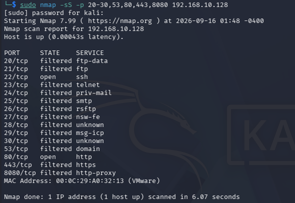
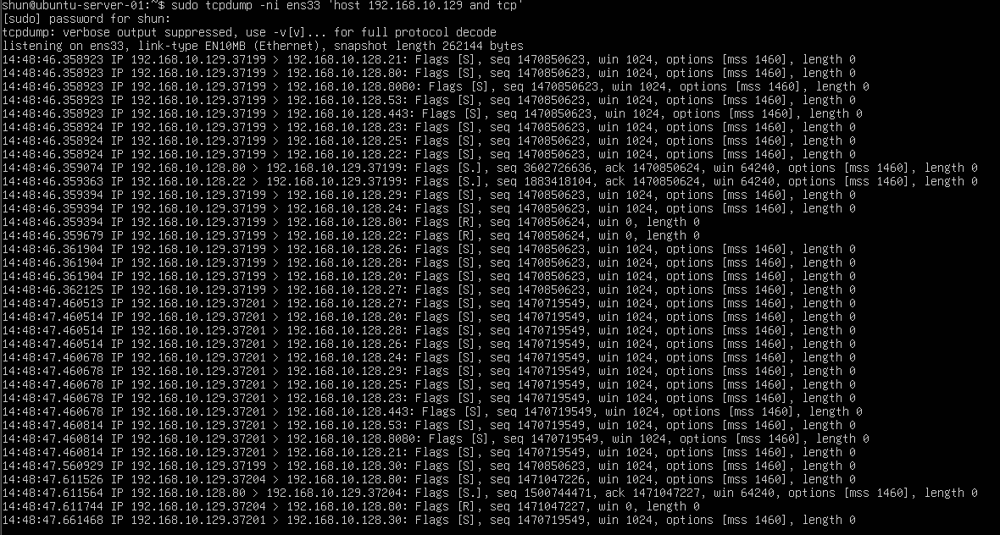
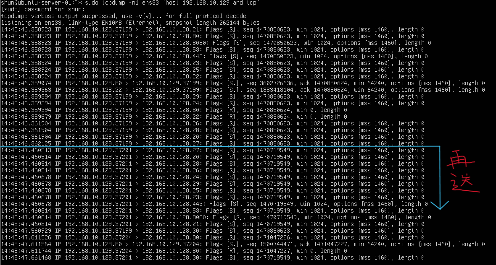
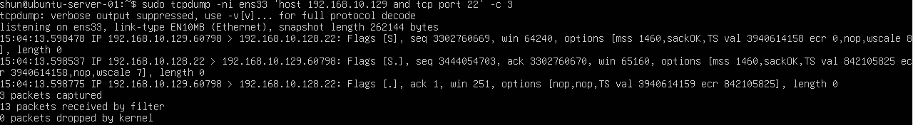

# Multi-Port SYN Scan Detection

## 目的

Kali LinuxからUbuntu Serverへ複数ポートを対象にTCP SYN Scanを実行し、
スキャンを受ける側から通信パターンを観察する。

これまでの実験では、
1つのポートに対するSYN ScanやTCP Connect Scanを確認した。

今回は複数ポートへ短時間にSYNを送信し、
通常のSSH接続との違いを比較する。

## 環境

- Kali Linux
  - IPv4: `192.168.10.129`

- Ubuntu Server
  - IPv4: `192.168.10.128`

- VMware Host-only Network
  - Network: `192.168.10.0/24`

## 1. Ubuntu ServerでTCP通信を監視

Ubuntu Serverで以下のコマンドを実行した。

    sudo tcpdump -ni ens33 'host 192.168.10.129 and tcp'

Kali LinuxからUbuntu Serverへ送信されるTCP通信を監視した。

## 2. 複数ポートへのSYN Scan

Kali Linuxから以下のコマンドを実行した。

    sudo nmap -sS -p 20-30,53,80,443,8080 192.168.10.128

対象ポートは、

- TCP 20〜30
- TCP 53
- TCP 80
- TCP 443
- TCP 8080

とした。

### Nmap実行結果

主な結果は以下のとおりだった。

    22/tcp open ssh
    80/tcp open http

その他の多くのポートは、

    filtered

と判定された。

## 3. tcpdumpで確認した通信

tcpdumpでは、
Kali LinuxからUbuntu Serverの複数ポートへ
短時間に多数のSYNが送信されていることを確認した。

例:

    Kali → Ubuntu:21    SYN
    Kali → Ubuntu:80    SYN
    Kali → Ubuntu:8080  SYN
    Kali → Ubuntu:53    SYN
    Kali → Ubuntu:443   SYN
    Kali → Ubuntu:23    SYN
    Kali → Ubuntu:25    SYN
    Kali → Ubuntu:22    SYN

1つのサービスへ接続するのではなく、
同じ送信元から複数の宛先ポートへ
短時間にSYNが送信されていた。

これはポートスキャンで見られる特徴的な通信パターンの1つである。

## 4. openポートの通信

22番ポートと80番ポートでは、
Ubuntu ServerからSYN/ACKが返された。

通信は以下のようになった。

    Kali → Ubuntu   SYN
    Ubuntu → Kali   SYN/ACK
    Kali → Ubuntu   RST

NmapのSYN Scanでは、
SYN/ACKを確認した時点でポートがopenであると判断できるため、
通常のTCP接続のように3-way handshakeを完了せず、
RSTを送信して接続を終了する。

## 5. filteredポートの通信

443番や8080番など、
Nmapで `filtered` と判定されたポートでは、

    Kali → Ubuntu   SYN

に対してUbuntu Serverから明確な応答が返らなかった。

そのためNmapは、

- ポートがFirewallによって遮断されている
- 通信経路上でパケットが破棄されている

などの可能性があると判断し、
`filtered` と表示した。

## 6. SYNの再送

tcpdumpでは、
応答がないポートに対して
Nmapが再びSYNを送信している様子も確認した。

最初のSYNに応答がなかった場合、
Nmapはすぐに判断せず、
再試行を行うことがある。

### 無応答ポートへの再送

このため受信側から見ると、

    複数ポートへSYN
    ↓
    一部だけ応答
    ↓
    応答がないポートへ再びSYN

という通信パターンが見える。

## 7. 通常のSSH接続との比較

次に、
ポートスキャンではなく通常のSSH接続を行い、
TCP接続開始時の通信を比較した。

Ubuntu Serverで以下を実行した。

    sudo tcpdump -ni ens33 'host 192.168.10.129 and tcp port 22' -c 3

Kali Linuxから通常どおりSSH接続した。

    ssh shun@192.168.10.128

### 実行結果

通常のSSH接続では、

    Kali → Ubuntu   SYN
    Ubuntu → Kali   SYN/ACK
    Kali → Ubuntu   ACK

という3-way handshakeを確認した。

## 8. SYN Scanと通常接続の違い

SYN Scanの場合:

    SYN
    ↓
    SYN/ACK
    ↓
    RST

通常のSSH接続の場合:

    SYN
    ↓
    SYN/ACK
    ↓
    ACK
    ↓
    通信開始

この違いから、
SYN Scanではポートの状態を確認することが目的であり、
通常のアプリケーション通信のように
TCP接続を最後まで確立しないことを確認できた。

## 9. ポートスキャンらしい通信とは

今回の実験から、
単にSYNパケットが存在するだけでは
ポートスキャンとは判断できないことが分かった。

通常のWebアクセスやSSH接続でも、
TCP接続開始時にはSYNが送信される。

ポートスキャンでは、

- 同じ送信元から
- 短時間に
- 多数の異なる宛先ポートへ
- SYNが送信される

という通信パターンが見られる。

そのため、
IDSやIPSなどでポートスキャンを検出する場合は、
単一のパケットだけではなく、
一定時間内の通信パターンを観察することが重要になる。

## 学んだこと

- 複数ポートへのSYN Scanでは短時間に多数のSYNが送信される
- openポートではSYN/ACKが返る
- filteredポートでは明確な応答が返らないことがある
- 応答がない場合はNmapがSYNを再送することがある
- SYN Scanでは3-way handshakeを完成させずRSTで終了する
- 通常のSSH接続では3-way handshakeを完成させる
- SYNパケットがあるだけではポートスキャンとは判断できない
- ポートスキャン検出では通信全体のパターンを見ることが重要である
- 今回の観察内容はIDSやSuricataによる検知学習につながる

## Next

ポートスキャンの基本的な仕組みと、
攻撃側・受信側の両方からの観察ができた。

次はこれまで使用したNmapのスキャン方式を整理し、
`02-port-scanning` 章のまとめを行う。
