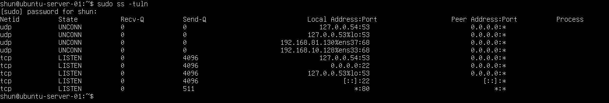
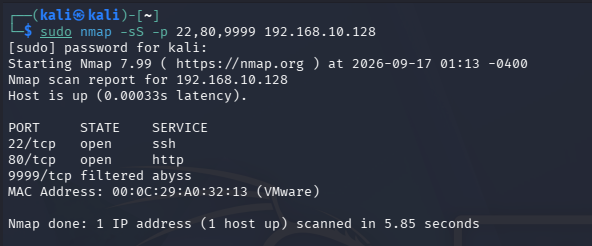
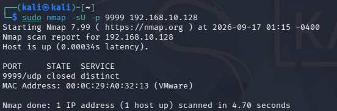
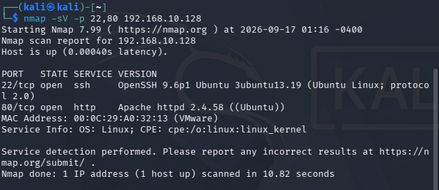

# Nmap Scan Summary

## 目的

これまでの `02-port-scanning` では、
Nmapを使用してTCP・UDPポートの状態やサービスを調査し、
tcpdumpやssを組み合わせて実際の通信を確認した。

この実験では、
これまで使用した代表的なNmapのスキャン方式をもう一度実行し、
それぞれの役割とポート状態の判定方法を整理する。

この記録をもって、
`02-port-scanning` のまとめとする。

## 環境

- Kali Linux
  - IPv4: `192.168.10.129`

- Ubuntu Server
  - IPv4: `192.168.10.128`

- VMware Host-only Network
  - Network: `192.168.10.0/24`

## 1. Ubuntu Server内部の待受状態を確認

Ubuntu Serverで以下のコマンドを実行した。

    sudo ss -tuln

### 実行結果

主に以下のTCPポートが待ち受けていた。

    22/tcp
    80/tcp

22番ではSSH、
80番ではHTTPサービスが動作している。

一方、
以前UDP実験で使用した9999番ポートでは
現在サービスは待ち受けていなかった。

## 2. TCP SYN Scan

Kali Linuxから以下を実行した。

    sudo nmap -sS -p 22,80,9999 192.168.10.128

### 実行結果

結果:

    22/tcp    open      ssh
    80/tcp    open      http
    9999/tcp  filtered

`-sS` はTCP SYN Scanを実行する。

これまでの実験では、
openポートで以下の通信を確認した。

    SYN
    ↓
    SYN/ACK
    ↓
    RST

SYN/ACKが返った時点でopenと判断できるため、
通常のTCP接続のように3-way handshakeを最後まで完成させない。

## 3. TCP Connect Scan

以下を実行した。

    nmap -sT -p 22,80 192.168.10.128

結果:

    22/tcp open ssh
    80/tcp open http

`-sT` はTCP Connect Scanである。

TCP SYN Scanとは異なり、
OSの通常のTCP接続機能を使用して接続を確立する。

これまでのtcpdumpによる比較では、

TCP SYN Scan:

    SYN
    ↓
    SYN/ACK
    ↓
    RST

TCP Connect Scan:

    SYN
    ↓
    SYN/ACK
    ↓
    ACK

という違いを確認した。

## 4. UDP Scan

以下を実行した。

    sudo nmap -sU -p 9999 192.168.10.128

### 実行結果

今回は、

    9999/udp closed

と判定された。

以前の実験では、
同じUDP 9999番ポートを使用して、

    closed
    open|filtered
    open

の3つの状態を確認した。

現在はUDP 9999番ポートで
サービスが待ち受けていないため、
以前socatを起動していたときとは結果が異なった。

このことから、
Nmapの結果は固定された情報ではなく、
スキャン時点のサービスやFirewallなどの状態によって変化することが分かる。

## 5. Service Version Detection

以下を実行した。

    nmap -sV -p 22,80 192.168.10.128

### 実行結果

以下のサービス情報を確認した。

    22/tcp
    OpenSSH 9.6p1 Ubuntu

    80/tcp
    Apache httpd 2.4.58 ((Ubuntu))

`-sV` は単純にポートのopen/closedを調べるだけではなく、
対象サービスへプローブを送信し、
サービスの種類やバージョン情報を推測するために使用される。

## 6. 各スキャン方式の整理

### TCP SYN Scan

    nmap -sS

目的:

    TCPポートの状態を調査する

特徴:

    SYN → SYN/ACK → RST

openポートでも通常のTCP接続を最後まで確立しない。

### TCP Connect Scan

    nmap -sT

目的:

    TCPポートの状態を調査する

特徴:

    SYN → SYN/ACK → ACK

OSの通常のTCP接続処理を使用する。

### UDP Scan

    nmap -sU

目的:

    UDPポートの状態を調査する

UDPにはTCPの3-way handshakeのような
共通の接続確立処理が存在しない。

そのため、

    UDP response
    → open

    ICMP Port Unreachable
    → closed

    no response
    → open|filtered

のように判定される。

### Service Version Detection

    nmap -sV

目的:

    openポートで動作しているサービスを詳しく調査する

例:

    OpenSSH
    Apache HTTP Server

さらに、
応答内容などからバージョン情報も推測する。

## 7. TCPとUDPでは同じポート番号でも別物

今回、

    9999/tcp filtered

である一方、

    9999/udp closed

という異なる結果になった。

TCPとUDPでは同じ9999という番号を使用していても、

    TCP 9999
    UDP 9999

は別々の通信エンドポイントとして扱われる。

そのため、
ポートを確認するときは番号だけでなく、
TCPなのかUDPなのかも確認する必要がある。

## 8. ポート状態のまとめ

### TCP

open:

    SYN
    ↓
    SYN/ACK

closed:

    SYN
    ↓
    RST/ACK

filtered:

    SYN
    ↓
    明確な応答なし

### UDP

open:

    UDP
    ↓
    UDP response

closed:

    UDP
    ↓
    ICMP Port Unreachable

open|filtered:

    UDP
    ↓
    明確な応答なし

## 9. 複数の視点から確認する重要性

これまでの実験では、
1つのツールだけではなく複数のツールを組み合わせた。

    ss
    → サーバー内部の待受状態

    Nmap
    → ネットワーク越しに見える状態

    tcpdump
    → 実際に流れているパケット

    UFW
    → 通信を許可・遮断するFirewall

例えばサービスが内部で待ち受けていても、
Firewallによって通信が遮断されていれば、
外部からはopenとして見えないことがある。

そのため、
ネットワーク障害やセキュリティ調査では
複数の視点から状態を確認することが重要である。

## 学んだこと

- ポートがLISTENしていることと外部から到達できることは別である
- Nmapは相手から返ってくるパケットをもとにポート状態を判断している
- TCPではSYN/ACK・RSTなどから状態を判断できる
- UDPでは応答がない場合に状態を断定できないことがある
- TCP SYN ScanとTCP Connect Scanでは接続処理が異なる
- `-sV` によってサービスやバージョン情報を調査できる
- TCPとUDPでは同じポート番号でも別々に状態を持つ
- Firewallによって外部から見えるポート状態が変化する
- Nmapの結果は固定ではなくスキャンした時点の状態を示している
- ポートスキャンは攻撃だけでなくネットワーク管理やセキュリティ診断にも利用される
- `ss`・Nmap・tcpdump・UFWを組み合わせることで通信状態をより正確に理解できる

## Next Chapter

`02-port-scanning` では、
ポートスキャンの基本からTCP・UDPの状態判定、
Firewall、サービス検出、
スキャンされる側からのパケット観察まで確認した。

次は、

    03-packet-analysis

へ進み、
パケットの内容やプロトコルをより詳しく解析する。
