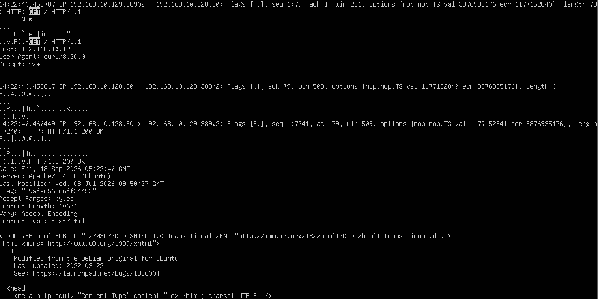

# HTTP Plaintext Packet Capture

## 目的

HTTP通信を `tcpdump` でキャプチャし、
ネットワーク上を流れるHTTPリクエスト・レスポンスの内容を確認する。

これまでの章では、
主にTCPやUDPの接続状態やポート状態を観察してきた。

この章ではさらに一段深く、
TCPの上で実際にどのようなアプリケーションデータが送受信されているのかを確認する。

今回は暗号化されていないHTTP通信を使用し、
パケットからHTTPヘッダやHTML本文を読み取る。

## 環境

- Kali Linux
  - IPv4: `192.168.10.129`

- Ubuntu Server 24.04 LTS
  - IPv4: `192.168.10.128`

- VMware Workstation
- Host-only Network
  - `192.168.10.0/24`

- Ubuntu Server
  - Apache HTTP Server
  - TCP 80

## 1. HTTPサーバーの待受確認

Ubuntu Serverで以下を実行した。

    sudo ss -tln | grep :80

TCP 80番ポートがLISTENしていることを確認した。

これにより、
Ubuntu Server上でHTTPサーバーが接続を待ち受けていることを確認した。

## 2. tcpdumpでHTTP通信をキャプチャ

Ubuntu Serverで以下を実行した。

    sudo tcpdump -ni ens33 -A 'host 192.168.10.129 and tcp port 80'

今回使用した `-A` オプションは、
パケットのペイロードをASCII形式で表示するために使用する。

これによって、
HTTPのようなテキストベースのプロトコルでは
通信内容を人間が読める文字として確認できる。

## 3. Kali LinuxからHTTPアクセス

Kali Linuxから以下を実行した。

    curl http://192.168.10.128/

Ubuntu Serverで動作しているApacheへHTTPリクエストを送信した。

Kali側では、
ApacheのデフォルトページのHTMLが表示された。

## 4. HTTPリクエストの確認

tcpdumpの結果から、
Kali LinuxからUbuntu Serverへ送信されたHTTPリクエストを確認できた。

### 実行結果

キャプチャには以下の内容が表示された。

    GET / HTTP/1.1
    Host: 192.168.10.128
    User-Agent: curl/8.20.0
    Accept: */*

`GET / HTTP/1.1` は、
Webサーバーの `/` にあるリソースを取得するHTTPリクエストである。

また、

    Host: 192.168.10.128

から接続先を確認でき、

    User-Agent: curl/8.20.0

からcurlを使用してアクセスしていることも確認できた。

## 5. TCPペイロードとしてのHTTP

HTTPリクエストが含まれているパケットでは、
tcpdumpに以下のTCPフラグが表示された。

    Flags [P.]

`[P.]` は、

    PSH + ACK

を表している。

TCP接続が確立した後、
HTTPリクエストなどのアプリケーションデータが
TCPのペイロードとして送信されていることを確認できた。

HTTPはTCPとは別のプロトコルだが、
HTTPデータはTCPによって運ばれている。

今回の通信は、

    Ethernet
        ↓
    IP
        ↓
    TCP
        ↓
    HTTP

という階層で構成されている。

## 6. HTTPレスポンスの確認

Ubuntu ServerからKali Linuxへ返された通信では、
以下の内容を確認できた。

    HTTP/1.1 200 OK

    Server: Apache/2.4.58 (Ubuntu)
    Content-Length: 10671
    Content-Type: text/html

`200 OK` は、
HTTPリクエストが正常に処理されたことを表す。

また、

    Server: Apache/2.4.58 (Ubuntu)

から、
HTTPサーバーとしてApacheが動作していることも確認できた。

さらに、

    Content-Type: text/html

から、
レスポンスのデータがHTMLであることを確認できた。

## 7. HTML本文の確認

HTTPレスポンスヘッダの後には、
WebページのHTML本文も表示された。

例:

    <!DOCTYPE html PUBLIC ...>
    <html ...>

つまりtcpdumpを使用すると、
HTTP通信ではHTTPヘッダだけでなく、
Webサーバーから送信されるコンテンツの内容まで確認できる。

## 8. HTTPが平文で見える理由

今回使用したHTTPでは、
通信内容そのものを暗号化する仕組みがない。

そのため、
ネットワーク上を流れるパケットを取得できる環境では、

- HTTPメソッド
- アクセス先
- HTTPヘッダ
- User-Agent
- サーバー情報
- HTML本文

などを読み取ることができる。

今回の実験では、

    GET / HTTP/1.1

や、

    HTTP/1.1 200 OK

だけでなく、
HTML本文まで平文で確認できた。

## 9. これまでの実験との違い

これまでtcpdumpでは主に、

    SYN
    SYN/ACK
    ACK
    RST
    FIN

などのTCPフラグを観察してきた。

今回はTCP接続そのものではなく、
接続確立後にTCPによって運ばれる
アプリケーションデータの内容を観察した。

つまり、

    TCP接続を見る
        ↓
    TCPの中で運ばれるデータを見る

という次の段階へ進んだ。

## 学んだこと

- HTTP通信はTCP上で動作している
- `tcpdump -A` でパケットのペイロードをASCII表示できる
- HTTPリクエストの `GET` や `Host` をパケットから確認できる
- User-Agentから使用しているクライアント情報を確認できる
- HTTPレスポンスの `200 OK` を確認できる
- ServerヘッダからApacheの情報を確認できる
- HTTPレスポンスのHTML本文までパケットから読み取れる
- `[P.]` はPSH + ACKを表し、アプリケーションデータを含む通信で確認できた
- HTTPは暗号化されていないため通信内容が平文で確認できる
- TCPフラグだけでなくTCPペイロードを解析することでアプリケーション層の通信を観察できる

## Next

次はHTTPより構造を絞ってパケットを解析し、

- Ethernet
- IP
- TCP
- HTTP

の各層にどのような情報が含まれているかを確認する。

その後、
暗号化されたHTTPS通信との違いも比較していく。
