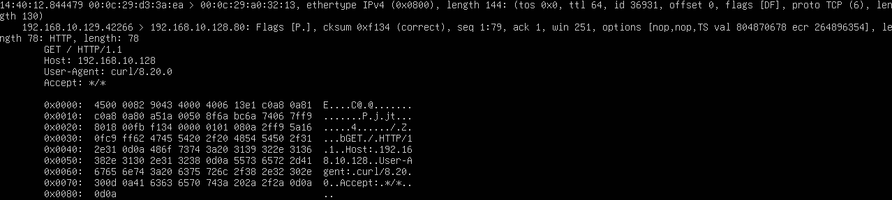
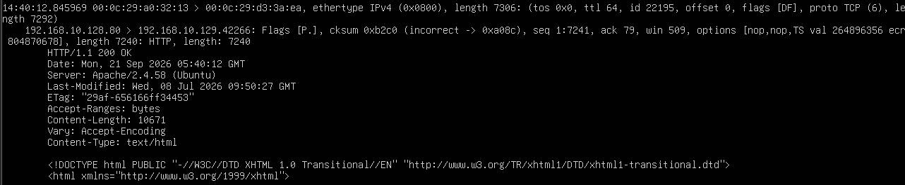

# HTTP Layer Analysis

## 目的

HTTP通信を `tcpdump` で詳細表示し、
1つの通信の中に、

- Ethernet
- IP
- TCP
- HTTP

の各層がどのように含まれているかを確認する。

前回はHTTP通信の内容が平文で読み取れることを確認した。

今回は、
同じHTTP通信をより詳細に観察し、
各層の役割とデータの入れ子構造を理解する。

## 環境

- Kali Linux
  - IPv4: `192.168.10.129`

- Ubuntu Server 24.04 LTS
  - IPv4: `192.168.10.128`

- VMware Workstation
- Host-only Network
  - `192.168.10.0/24`

- Ubuntu Server
  - Apache HTTP Server
  - TCP 80

## 1. 詳細なパケットキャプチャ

Ubuntu Serverで以下のコマンドを実行した。

    sudo tcpdump -eni ens33 -vvv -X 'host 192.168.10.129 and tcp port 80'

今回使用した主なオプションは以下のとおり。

    -e
    Ethernetヘッダを表示する

    -n
    IPアドレスやポート番号を名前解決せず、そのまま表示する

    -i ens33
    ens33インターフェースを監視する

    -vvv
    パケットの詳細情報を多く表示する

    -X
    パケット内容を16進数とASCIIの両方で表示する

## 2. Kali LinuxからHTTPアクセス

Kali Linuxから以下を実行した。

    curl http://192.168.10.128/

これにより、
Kali LinuxからUbuntu ServerのApacheへHTTPリクエストを送信した。

## 3. HTTPリクエスト側のパケット

### 実行結果

HTTPリクエストを含むパケットでは、
以下のような情報を確認できた。

    00:0c:29:d3:3a:ea > 00:0c:29:a0:32:13
    ethertype IPv4 (0x0800)

    192.168.10.129.42266 > 192.168.10.128.80

    Flags [P.]

    GET / HTTP/1.1
    Host: 192.168.10.128
    User-Agent: curl/8.20.0
    Accept: */*

この1つのパケットから、
複数のプロトコル層の情報を確認できた。

## 4. Ethernet層

以下の部分はEthernet層の情報である。

    00:0c:29:d3:3a:ea > 00:0c:29:a0:32:13

左側が送信元MACアドレス、
右側が宛先MACアドレスである。

今回の通信では、

    Kali Linux
        ↓
    Ubuntu Server

へEthernetフレームが送信されている。

また、

    ethertype IPv4 (0x0800)

から、
Ethernetフレームの内部にIPv4パケットが含まれていることを確認できる。

## 5. IP層

次に以下のIPアドレスを確認できた。

    192.168.10.129
        ↓
    192.168.10.128

送信元はKali Linux、
宛先はUbuntu Serverである。

IP層は、
通信先のホストを識別し、
パケットを宛先まで届けるために使用される。

## 6. TCP層

tcpdumpでは以下のように表示された。

    192.168.10.129.42266 > 192.168.10.128.80

このうち、

    42266
        ↓
    80

がTCPポート番号である。

42266番はKali Linux側で一時的に使用された送信元ポート、
80番はUbuntu Server側のHTTPサービスの待受ポートである。

また、

    Flags [P.]

も確認できた。

`[P.]` は、

    PSH + ACK

を表す。

このTCPセグメントには、
HTTPリクエストのアプリケーションデータが含まれている。

## 7. HTTP層

TCPのペイロードとして、
以下のHTTPデータを確認できた。

    GET / HTTP/1.1
    Host: 192.168.10.128
    User-Agent: curl/8.20.0
    Accept: */*

これはKali LinuxからUbuntu Serverへ送信された
HTTPリクエストである。

つまり、

    Ethernet
        ↓
    IP
        ↓
    TCP
        ↓
    HTTP

という構造になっている。

## 8. プロトコルの入れ子構造

今回の通信は、
各プロトコルが完全に別々に流れているわけではない。

概念的には、

    Ethernetフレーム
    └── IPパケット
        └── TCPセグメント
            └── HTTPデータ

という形で、
上位層のデータが下位層のペイロードとして格納されている。

例えば、

TCPから見ると、

    HTTPデータ

がペイロードになる。

一方、
IPから見ると、

    TCPヘッダ
    +
    HTTPデータ

がIPのペイロードになる。

このように、
どの層を基準に見るかによって
ペイロードの内容は変わる。

## 9. 16進数とASCII表示

`-X` オプションを使用したため、
パケットの内容が16進数とASCIIの両方で表示された。

例:

    0x0000:
    0x0010:
    0x0020:
    ...

右側のASCII表示では、

    GET / HTTP/1.1
    Host:
    User-Agent:
    Accept:

などの文字列を確認できた。

HTTPリクエストも、
実際にはネットワーク上をバイト列として送信されている。

tcpdumpはそのバイト列を、
16進数と読み取り可能なASCII文字の両方で表示している。

## 10. HTTPレスポンス側のパケット

### 実行結果

Ubuntu ServerからKali Linuxへ返される通信では、

    192.168.10.128.80 > 192.168.10.129.42266

となっていた。

リクエスト時とは、
送信元と宛先が逆になっている。

HTTPデータとして、

    HTTP/1.1 200 OK

    Server: Apache/2.4.58 (Ubuntu)
    Content-Length: 10671
    Content-Type: text/html

などを確認できた。

さらにレスポンスヘッダの後には、

    <!DOCTYPE html ...>

から始まるHTML本文も含まれていた。

## 11. リクエストとレスポンスの対応

今回の通信は以下のように整理できる。

    Kali Linux
    192.168.10.129:42266
            ↓
        GET /
            ↓
    Ubuntu Server
    192.168.10.128:80

そしてUbuntu Serverから、

    Ubuntu Server
    192.168.10.128:80
            ↓
        200 OK
        HTML
            ↓
    Kali Linux
    192.168.10.129:42266

というレスポンスが返された。

同じTCP接続を利用して、
HTTPリクエストとHTTPレスポンスが送受信されていることを確認した。

## 学んだこと

- Ethernetヘッダには送信元・宛先MACアドレスが含まれる
- EtherTypeからEthernet内部のプロトコルを確認できる
- IP層では送信元・宛先IPアドレスを確認できる
- TCP層では送信元・宛先ポート番号を確認できる
- HTTPデータはTCPのペイロードとして送信される
- Ethernet・IP・TCP・HTTPは入れ子構造になっている
- `tcpdump -e` でEthernetヘッダを確認できる
- `tcpdump -X` でパケットを16進数とASCIIの両方で確認できる
- HTTPの文字列も実際にはバイト列として送信されている
- HTTPリクエストとHTTPレスポンスは同じTCP接続上で送受信される
- プロトコルごとに「ペイロード」と呼ばれる範囲が異なる

## Next

次は、
今回表示した16進数データを利用して、

- IPヘッダ
- TCPヘッダ
- HTTPデータ

が実際にどこからどこまで格納されているのかを確認する。

その後、
HTTPS通信をキャプチャし、
HTTPと暗号化通信の違いも比較していく。
