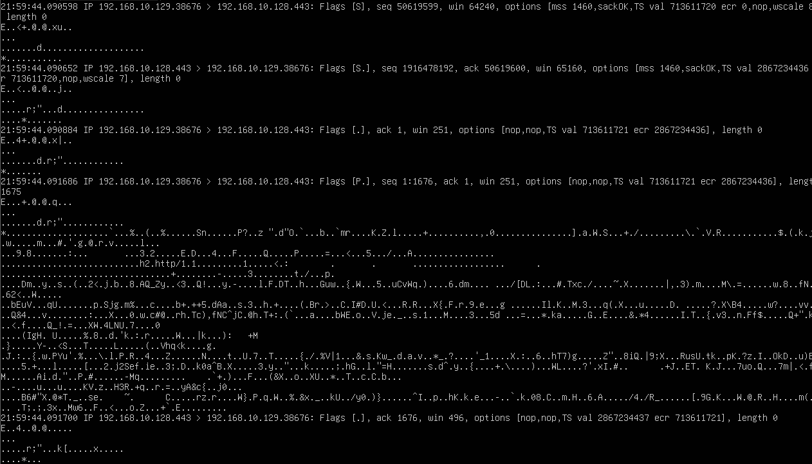

# HTTP vs HTTPS Packet Capture

## 目的

HTTP通信とHTTPS通信をtcpdumpで比較し、
TLSによる暗号化によってネットワーク上から確認できる情報が
どのように変化するかを観察する。

HTTPでは、

- HTTPリクエスト
- HTTPレスポンス
- HTML本文

まで平文で確認できた。

今回はHTTPS通信を構築し、
同じようにパケットをキャプチャして、
HTTPとの違いを確認する。

## 環境

- Kali Linux
  - IPv4: `192.168.10.129`

- Ubuntu Server 24.04 LTS
  - Host-only IPv4: `192.168.10.128`

- VMware Workstation
- Host-only Network
  - `192.168.10.0/24`

- Ubuntu Server
  - Python HTTPS Server
  - TCP 443

## 1. 自己署名証明書の作成

HTTPS通信を行うため、
Ubuntu Serverで自己署名証明書を作成した。

    openssl req -x509 -newkey rsa:2048 \
      -keyout key.pem \
      -out cert.pem \
      -days 1 \
      -nodes \
      -subj "/CN=192.168.10.128"

これにより、

    key.pem
    cert.pem

を作成した。

今回は学習用の閉じた環境で使用するため、
自己署名証明書を利用した。

## 2. HTTPS用HTMLの作成

テスト用のHTMLを作成した。

    echo '<h1>HTTPS TEST</h1>' > index.html

## 3. PythonでHTTPSサーバーを起動

Python標準ライブラリを使用して、
TCP 443番ポートでHTTPSサーバーを起動した。

    sudo python3 - <<'PY'
    import http.server
    import ssl

    server = http.server.HTTPServer(
        ("0.0.0.0", 443),
        http.server.SimpleHTTPRequestHandler
    )

    context = ssl.SSLContext(ssl.PROTOCOL_TLS_SERVER)
    context.load_cert_chain(
        certfile="cert.pem",
        keyfile="key.pem"
    )

    server.socket = context.wrap_socket(
        server.socket,
        server_side=True
    )

    print("HTTPS server listening on port 443")
    server.serve_forever()
    PY

443番ポートは1024未満の特権ポートであるため、
`sudo` を使用した。

## 4. HTTPSサーバーの待受確認

Ubuntu Serverで以下を実行した。

    sudo ss -tln | grep :443

以下のように443番ポートがLISTENしていることを確認した。

    0.0.0.0:443

## 5. UFWで443/tcpを許可

最初はKali LinuxからHTTPSサーバーへ接続できなかった。

UFWを確認すると、
443/tcpが許可されていなかった。

そこで以下を実行した。

    sudo ufw allow 443/tcp

これにより、
Kali LinuxからUbuntu ServerのHTTPSサービスへ
接続できるようになった。

## 6. ネットワーク経路の確認

途中でtcpdumpにHTTPS通信が表示されなかった。

確認したところ、
Kali LinuxがHost-onlyネットワークではなく
NAT側ネットワークへ接続されており、

    192.168.81.131

が割り当てられていた。

Ubuntu Serverには、

    ens33
    192.168.10.128
    Host-only

    ens37
    192.168.81.130
    NAT

の2つのインターフェースが存在していた。

そのため、
HTTPS通信がens33ではなく
NAT側を通っていたことが原因だった。

Kali LinuxをHost-onlyネットワークへ戻し、

    192.168.10.129

を使用する構成に戻した。

これにより、
これまでのcybersecurity-labと同じネットワーク構成で
実験を継続した。

## 7. HTTPS通信をキャプチャ

Ubuntu Serverで以下を実行した。

    sudo tcpdump -ni ens33 -A 'host 192.168.10.129 and tcp port 443'

その状態でKali Linuxから、

    curl -k https://192.168.10.128/

を実行した。

`-k` は自己署名証明書の検証エラーを無視するために使用した。

これはTLS暗号化を無効化するオプションではない。

HTTPS通信そのものはTLSによって暗号化されている。

Kali Linuxでは、

    <h1>HTTPS TEST</h1>

が正常に表示された。

## 8. HTTPSパケットの確認

### 実行結果

tcpdumpでは、

    192.168.10.129.38676 > 192.168.10.128.443

のように、
IPアドレスとTCPポート番号を確認できた。

しかし、
HTTP通信で確認できたような、

    GET / HTTP/1.1

    Host: 192.168.10.128

    HTTP/1.1 200 OK

    <h1>HTTPS TEST</h1>

といったHTTPデータは
平文では確認できなかった。

代わりに、
人間がそのまま読めないバイト列が表示された。

## 9. HTTPとの比較

HTTP通信では、
tcpdumpから以下を確認できた。

    GET / HTTP/1.1
    Host: 192.168.10.128
    User-Agent: curl/...
    Accept: */*

さらにレスポンスでは、

    HTTP/1.1 200 OK
    Server: Apache/...
    Content-Type: text/html
    HTML本文

まで確認できた。

一方HTTPSでは、

    192.168.10.129
        ↓
    192.168.10.128:443

という通信自体は確認できるが、
HTTPリクエストやHTML本文を
そのまま読むことはできなかった。

## 10. HTTPSで見える情報

HTTPSであっても、
すべての情報が見えなくなるわけではない。

今回のキャプチャでは、

- 送信元IPアドレス
- 宛先IPアドレス
- 送信元TCPポート
- 宛先TCPポート
- TCPフラグ
- パケット長
- 通信時刻

などを確認できた。

これらはIPヘッダやTCPヘッダなど、
通信を成立させるためにネットワーク機器が必要とする情報である。

## 11. HTTPSで見えなくなる情報

HTTPSでは、
HTTPデータがTLSによって暗号化される。

そのため、

- HTTPメソッド
- URLパス
- HTTPヘッダ
- User-Agent
- HTTPレスポンス本文
- HTMLコンテンツ

などは、
単純にtcpdumpで取得しただけでは
平文として読むことができない。

## 12. TLSの位置

HTTP通信では、

    Ethernet
        ↓
    IP
        ↓
    TCP
        ↓
    HTTP

という構造だった。

HTTPSでは概念的に、

    Ethernet
        ↓
    IP
        ↓
    TCP
        ↓
    TLS
        ↓
    HTTP

となる。

HTTPデータをTLSで暗号化してから、
TCPによって送信する。

そのため、
TCP通信自体は観察できても、
その内部にあるHTTPデータは直接読み取れない。

## 13. HTTPとHTTPSの整理

HTTP:

    Ethernet
        ↓
    IP
        ↓
    TCP
        ↓
    HTTP

    GET / HTTP/1.1
    HTML

    ↓

    平文で確認できる

HTTPS:

    Ethernet
        ↓
    IP
        ↓
    TCP
        ↓
    TLS
        ↓
    HTTP

    GET / HTTP/1.1
    HTML

    ↓

    TLSによって暗号化される

    ↓

    tcpdumpではそのまま読めない

## 学んだこと

- HTTPSではHTTPデータがTLSによって暗号化される
- HTTPSでもIPアドレスやTCPポート番号は確認できる
- TCP 443番ポートを利用してHTTPS通信を行った
- `curl -k` は証明書検証を無視するだけでTLS暗号化は維持される
- HTTPではGETやHTML本文を平文で確認できる
- HTTPSでは同じHTTPデータを直接読み取ることができない
- IPヘッダやTCPヘッダまで暗号化されるわけではない
- TLSはTCPとHTTPの間に位置する
- Firewallによって443/tcpが許可されていないとHTTPSサービスへ到達できない
- tcpdumpでは監視対象インターフェースと実際の通信経路を一致させる必要がある
- IPアドレスやルーティング情報の確認がパケット解析のトラブルシュートでも重要である

## Next

次はTLS通信そのものを詳しく観察し、

- TLS handshake
- TLS record
- 暗号化されたApplication Data

など、
HTTPS通信の中でTLSがどのように動作しているかを確認する。

必要に応じてWiresharkやtsharkも使用し、
tcpdumpだけでは分かりにくいTLS情報を解析する。
