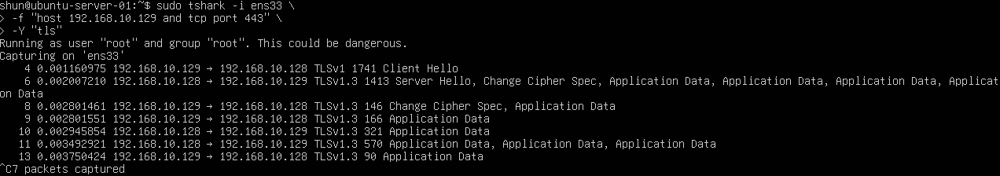
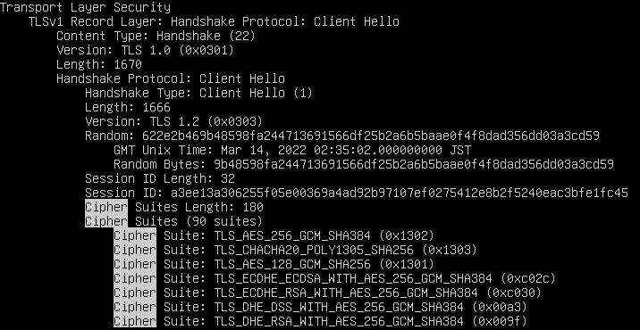
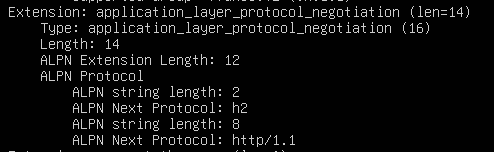
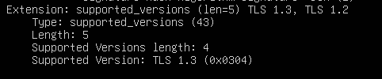

# TLS Handshake Analysis

## 目的

HTTPS通信を構成するTLSハンドシェイクを観察し、

- ClientHello
- ServerHello
- Application Data

がどのような順番で送受信されるかを確認する。

前回はHTTPS通信ではHTTPリクエストやHTML本文が
TLSによって暗号化されることを確認した。

今回はさらに一段深く、
HTTPS通信が始まる前にTLSがどのような情報を交換しているのかを解析する。

## 環境

- Kali Linux
  - IPv4: `192.168.10.129`

- Ubuntu Server 24.04 LTS
  - IPv4: `192.168.10.128`

- VMware Workstation
- Host-only Network
  - `192.168.10.0/24`

- Ubuntu Server
  - Python HTTPS Server
  - TCP 443

主に以下のツールを使用した。

- tcpdump
- tshark
- curl
- Python
- OpenSSL

## 1. HTTPSサーバーを起動

前回作成したPython HTTPSサーバーを使用した。

    sudo python3 https_server.py

HTTPSサーバーはTCP 443番ポートで待ち受ける。

## 2. tcpdumpによるTLS通信の確認

Ubuntu Serverで以下を実行した。

    sudo tcpdump -ni ens33 -vvv -X 'host 192.168.10.129 and tcp port 443'

その状態でKali Linuxから、

    curl -k https://192.168.10.128/

を実行した。

tcpdumpでは、

    TCP 3-way handshake
        ↓
    大量のTLSデータ
        ↓
    暗号化されたApplication Data

という流れを確認できた。

ただし、
tcpdumpの16進数表示だけでは、

    ClientHello
    ServerHello
    Application Data

などを判別しにくかった。

そのため、
TLSをプロトコルとして解析できるtsharkを使用した。

## 3. tsharkでTLS通信を解析

Ubuntu Serverで以下を実行した。

    sudo tshark -i ens33 \
      -f "host 192.168.10.129 and tcp port 443" \
      -Y "tls"

その状態でKali Linuxから、

    curl -k https://192.168.10.128/

を実行した。

### 実行結果

tsharkでは、
以下のような通信を確認できた。

    Kali → Ubuntu
    Client Hello

    Ubuntu → Kali
    Server Hello

    Ubuntu → Kali
    Application Data

    Kali → Ubuntu
    Application Data

これにより、
HTTPS通信ではHTTPデータを送る前に
TLSハンドシェイクが行われていることを確認できた。

## 4. TLS通信の流れ

今回の通信を大まかに整理すると、

    TCP 3-way handshake
            ↓
    TLS ClientHello
            ↓
    TLS ServerHello
            ↓
    TLSハンドシェイク
            ↓
    暗号化されたApplication Data

となる。

TCP接続が確立した後にTLSハンドシェイクを行い、
暗号化通信を確立してからHTTPデータを送信する。

## 5. ClientHelloの詳細確認

ClientHelloのみを詳しく確認するため、
以下を実行した。

    sudo tshark -i ens33 \
      -f "host 192.168.10.129 and tcp port 443" \
      -Y "tls.handshake.type == 1" \
      -V

### 実行結果

ClientHelloには、

- TLSバージョン情報
- Cipher Suites
- 拡張機能
- 対応する署名方式
- 鍵交換方式
- アプリケーションプロトコル

など、
TLS通信を開始するための多くの情報が含まれていた。

## 6. Cipher Suites

ClientHelloでは、
多数のCipher Suiteが提示されていた。

例:

    TLS_AES_256_GCM_SHA384
    TLS_CHACHA20_POLY1305_SHA256
    TLS_AES_128_GCM_SHA256

Cipher Suiteは、
TLS通信で利用可能な暗号方式の候補である。

ClientHelloではクライアントが、

    自分はこれらの暗号方式に対応している

という候補一覧をサーバーへ提示する。

その後、
サーバー側が使用する方式を選択する。

すべてのCipher Suiteを暗記することが目的ではなく、

    ClientHello
    ↓
    利用可能な暗号方式を提示
    ↓
    ServerHello
    ↓
    実際に使用する方式を決定

という流れを理解することが重要である。

## 7. ALPN

ClientHelloの拡張機能として、
ALPN
（Application-Layer Protocol Negotiation）
を確認した。

### 実行結果

以下のプロトコル候補が提示されていた。

    h2
    http/1.1

`h2` はHTTP/2を表す。

つまりクライアントはTLSハンドシェイク中に、

    HTTP/2を使用できる
    HTTP/1.1も使用できる

という情報をサーバーへ提示している。

TLSでは暗号方式だけでなく、
TLS接続の上でどのアプリケーションプロトコルを使用するかも
ネゴシエーションできる。

## 8. supported_versions

ClientHelloには、

    supported_versions

という拡張機能も含まれていた。

### 実行結果

以下を確認した。

    Supported Version: TLS 1.3

これにより、
Kali Linux側のTLSクライアントが
TLS 1.3に対応していることを確認できた。

## 9. TLS 1.3なのにTLS 1.2と表示される理由

ClientHelloの詳細表示では、

    Version: TLS 1.2 (0x0303)

という値も確認できた。

しかし、
実際の通信ではTLS 1.3が使用されている。

TLS 1.3では、
過去のTLS実装との互換性を維持するために、
ClientHelloの従来のVersionフィールドには
TLS 1.2を表す値を使用する。

実際に対応しているTLSバージョンは、

    supported_versions

Extensionで通知する。

今回、

    Supported Version: TLS 1.3

が確認できたため、
クライアントがTLS 1.3に対応していることが分かる。

ServerHelloでも、

    TLSv1.3 Server Hello

が確認できたため、
最終的にTLS 1.3が使用されている。

## 10. ServerHello

ClientHelloを受信したUbuntu Serverは、

    ServerHello

を返した。

ServerHelloでは、
クライアントが提示した候補の中から
TLS通信で実際に利用する設定を選択する。

概念的には、

    Client:
    TLS 1.3が使えます
    この暗号方式が使えます
    この鍵交換方式が使えます

            ↓

    Server:
    ではこの設定を使います

という流れになる。

## 11. Application Data

TLSハンドシェイク後には、

    TLSv1.3 Application Data

が双方向に送信されていた。

この中には、
実際にはHTTP通信の、

    GET / HTTP/1.1

や、

    <h1>HTTPS TEST</h1>

などが含まれている。

しかし、
TLSによって暗号化されているため、
tsharkからは内容を直接読むことができない。

確認できるのは、

    Application Dataが送信されている

という事実までである。

## 12. Change Cipher Spec

tsharkでは、

    Change Cipher Spec

も確認できた。

TLS 1.2以前では、
Change Cipher Specは暗号化開始に関連する重要なメッセージだった。

一方、
TLS 1.3では互換性のために
ダミー的なChange Cipher Specが送信されることがある。

そのため今回のTLS 1.3通信では、

    Change Cipher Spec
    = 暗号化開始そのもの

と単純に考えるのではなく、

    ServerHello以降、
    TLSハンドシェイク情報やApplication Dataが
    暗号化されていく

という流れを理解することが重要である。

## 13. ClientHelloに含まれる主な情報

今回確認したClientHelloを整理すると、

    ClientHello
    │
    ├── supported_versions
    │   └── TLS 1.3
    │
    ├── Cipher Suites
    │   └── 使用可能な暗号方式
    │
    ├── Supported Groups
    │   └── 鍵交換方式の候補
    │
    ├── Signature Algorithms
    │   └── 対応可能な署名方式
    │
    └── ALPN
        ├── h2
        └── http/1.1

となる。

ClientHelloは単なる接続開始通知ではなく、
TLS通信で利用可能な機能や方式を
サーバーへ提示するメッセージである。

## 14. HTTPS通信全体の流れ

今回の実験から、
HTTPS通信は以下のように成立していることを確認した。

    TCP Connection
        ↓
    ClientHello
        ↓
    ServerHello
        ↓
    TLS設定・鍵交換
        ↓
    暗号化通信の確立
        ↓
    Application Data
        ↓
    HTTP Request / Response

HTTP通信では、

    GET / HTTP/1.1

などがそのままTCPのペイロードとして確認できた。

HTTPSでは、
HTTPデータの前にTLSが存在し、

    HTTP
        ↓
    TLSによって暗号化
        ↓
    TCPで送信

という構造になる。

## 学んだこと

- HTTPS通信ではTCP接続後にTLSハンドシェイクが行われる
- ClientHelloはクライアントからサーバーへ送信される
- ServerHelloはサーバーからクライアントへ返される
- ClientHelloには対応可能なTLS設定が多数含まれる
- Cipher Suitesは利用可能な暗号方式候補を表す
- supported_versionsでTLS 1.3対応を確認できる
- TLS 1.3ではlegacy VersionフィールドにTLS 1.2が表示されることがある
- ALPNによってHTTP/2やHTTP/1.1などをネゴシエーションできる
- TLSハンドシェイク後のHTTPデータはApplication Dataとして暗号化される
- tcpdumpではTLS通信のバイト列を確認できる
- tsharkを使用するとTLSメッセージをプロトコルとして解析できる
- TLS 1.3ではServerHello以降のハンドシェイク情報の多くが暗号化される
- Change Cipher SpecはTLS 1.3では互換性目的で現れる場合がある

## Next

次は、
TLSハンドシェイクの中でも重要な、

- 証明書
- 公開鍵
- 鍵交換
- 共通鍵

の関係を整理する。

HTTPSで実際のHTTPデータを暗号化する鍵が、
どのように安全に共有されるのかを理解する。
