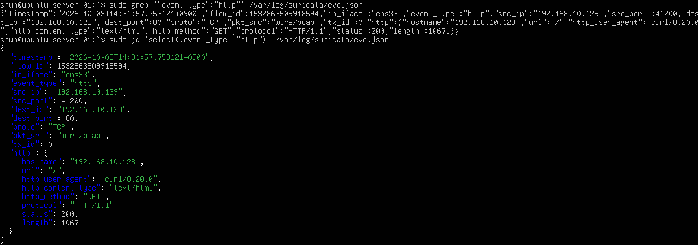

# Suricata Setup and HTTP Event Detection

## 目的

SuricataをUbuntu Serverへ導入し、

- 監視インターフェースの設定
- HOME_NETの設定
- ルールの導入
- 設定ファイルの検証
- Suricataの起動
- eve.jsonへのイベント記録
- HTTP通信の自動解析

までを確認する。

これまでの章ではtcpdumpやtsharkを使い、
人間が通信内容を確認していた。

この章ではSuricataを使用し、
ネットワーク通信を自動的に解析・分類する。

## 環境

- Windows 11 Host
- VMware Workstation

### Kali Linux

    IPv4: 192.168.10.129

### Ubuntu Server 24.04 LTS

    ens33: 192.168.10.128/24
    ens37: 192.168.81.130/24

### Lab Network

    192.168.10.0/24

Suricataでは、
Host-only Network側の `ens33` を監視する。

## 1. Suricataの確認

Suricataがインストールされているか確認した。

    suricata --build-info

Suricata 7.0.3がインストールされていることを確認した。

設定ファイルとログディレクトリは、

    Configuration directory:
    /etc/suricata/

    Log directory:
    /var/log/suricata/

となっていた。

## 2. ネットワークインターフェース確認

    ip addr

Ubuntu Serverでは、

    ens33
    192.168.10.128/24

となっていることを確認した。

また、

    ens37
    192.168.81.130/24

も存在していた。

`ens37` はパッケージ取得などに使用するNAT側であり、
今回Suricataが監視する対象は `ens33` とした。

## 3. HOME_NETの確認

Suricataの設定を確認した。

    sudo grep -n "HOME_NET" /etc/suricata/suricata.yaml | head

初期状態では、

    HOME_NET: "[192.168.0.0/16,10.0.0.0/8,172.16.0.0/12]"

となっていた。

今回のラボでは対象を明確にするため、

    HOME_NET: "[192.168.10.0/24]"

へ変更した。

HOME_NETは、
Suricataが内部ネットワークとして扱う範囲を表す。

## 4. 監視インターフェース設定

af-packetの設定を確認した。

    sudo grep -n -A 20 "^af-packet:" /etc/suricata/suricata.yaml

初期状態では、

    af-packet:
      - interface: eth0

となっていた。

Ubuntu Serverの監視対象インターフェースは `ens33` なので、

    af-packet:
      - interface: ens33

へ変更した。

これにより、
SuricataがHost-only Network上の通信を監視するように設定した。

## 5. 検知ルールの導入

設定テストを実行したところ、

    sudo suricata -T -c /etc/suricata/suricata.yaml

以下の警告が表示された。

    No rule files match the pattern
    /var/lib/suricata/rules/suricata.rules

これはSuricata本体は使用可能だが、
検知ルールがまだ存在していない状態であることを表していた。

ルールを取得するため、

    sudo suricata-update

を実行した。

Emerging Threats Openのルールが取得され、

    /var/lib/suricata/rules/suricata.rules

が作成された。

出力では、

    Loaded 68991 rules
    Enabled 53038 rules

となっており、
多数のルールが有効化された。

## 6. 設定ファイルのテスト

ルール導入後、

    sudo suricata -T -c /etc/suricata/suricata.yaml

を再実行した。

結果、

    Configuration provided was successfully loaded. Exiting.

と表示された。

これにより、

- YAML設定
- HOME_NET
- 監視インターフェース
- ルール

を含む設定が正常に読み込めることを確認した。

## 7. Suricataの起動

Ubuntu ServerでSuricataを起動した。

    sudo suricata -c /etc/suricata/suricata.yaml -i ens33

結果、

    Engine started.

と表示され、
Suricataが `ens33` 上で通信監視を開始した。

## 8. ログファイル確認

Suricataのログディレクトリを確認した。

    ls -lh /var/log/suricata/

以下のファイルが作成されていた。

    eve.json
    fast.log
    stats.log
    suricata.log

`eve.json` には、
Suricataが解析した各種イベントがJSON形式で記録される。

`fast.log` は主にアラート情報を簡潔に記録する。

今回、

    fast.log

は0バイトだった。

これはSuricataが動作していないという意味ではなく、
今回の通信が既存ルールによるアラート条件に一致しなかったためである。

## 9. Kaliから通信を発生

Kali LinuxからUbuntu ServerへNmapを実行した。

    sudo nmap -sS -p 20-30,80,443 192.168.10.128

結果、

    22/tcp  open
    80/tcp  open
    443/tcp closed

などが確認できた。

また、
通常のHTTP通信も発生させた。

    curl http://192.168.10.128/

## 10. eve.jsonのイベント種別確認

Suricataがどのようなイベントを記録したか確認した。

    sudo grep -o '"event_type":"[^"]*"' /var/log/suricata/eve.json | sort | uniq -c

以下のイベントが確認できた。

    dhcp
    dns
    fileinfo
    flow
    http
    stats

これによりSuricataが、
単にパケットを保存しているだけではなく、
通信内容を解析してイベント種別ごとに分類していることが分かった。

## 11. HTTPイベントの確認

HTTPイベントだけを確認した。

    sudo grep '"event_type":"http"' /var/log/suricata/eve.json

さらに `jq` を使用して見やすく表示した。

    sudo jq 'select(.event_type=="http")' /var/log/suricata/eve.json

以下の情報を確認した。

    in_iface: ens33
    event_type: http
    src_ip: 192.168.10.129
    dest_ip: 192.168.10.128
    dest_port: 80
    proto: TCP

HTTP情報として、

    hostname: 192.168.10.128
    url: /
    http_user_agent: curl/8.20.0
    http_method: GET
    protocol: HTTP/1.1
    status: 200

を確認した。

つまり、

    Kali Linux
    192.168.10.129
        ↓
    HTTP GET
        ↓
    Ubuntu Server
    192.168.10.128:80
        ↓
    HTTP 200

という通信を、
SuricataがHTTP通信として自動解析できた。

## 12. tcpdumpとの違い

これまで使用したtcpdumpでは、

    パケットを取得
        ↓
    人間が内容を読む
        ↓
    HTTP通信だと判断

という流れだった。

Suricataでは、

    パケットを取得
        ↓
    プロトコル解析
        ↓
    event_type=http
        ↓
    HTTP Method / URL / Statusなどを抽出

という処理を自動的に行う。

Suricataは、
パケットキャプチャだけではなく、

- プロトコル解析
- イベント分類
- ルール判定
- アラート生成

まで実行できるIDSである。

## 学んだこと

- Suricataはネットワーク通信を監視するIDSである
- HOME_NETで内部ネットワーク範囲を指定できる
- af-packetで監視インターフェースを指定できる
- 今回は `ens33` を監視対象とした
- `suricata-update` で検知ルールを取得できる
- `suricata -T` で設定ファイルを検証できる
- `eve.json` にはイベントがJSON形式で記録される
- `fast.log` は主にアラート記録に使用される
- アラートがなくてもSuricataは通信を解析している
- SuricataはHTTP通信を自動的に識別できる
- HTTP Method、URL、User-Agent、Statusなどを抽出できる
- tcpdumpより上位レベルで通信を自動解析できる

## Next

次回はSuricataのルールについて学ぶ。

独自ルールを作成し、

    特定の通信
        ↓
    Rule Match
        ↓
    Alert

という流れを実際に確認する。

次の記録：

    02-suricata-rules.md
